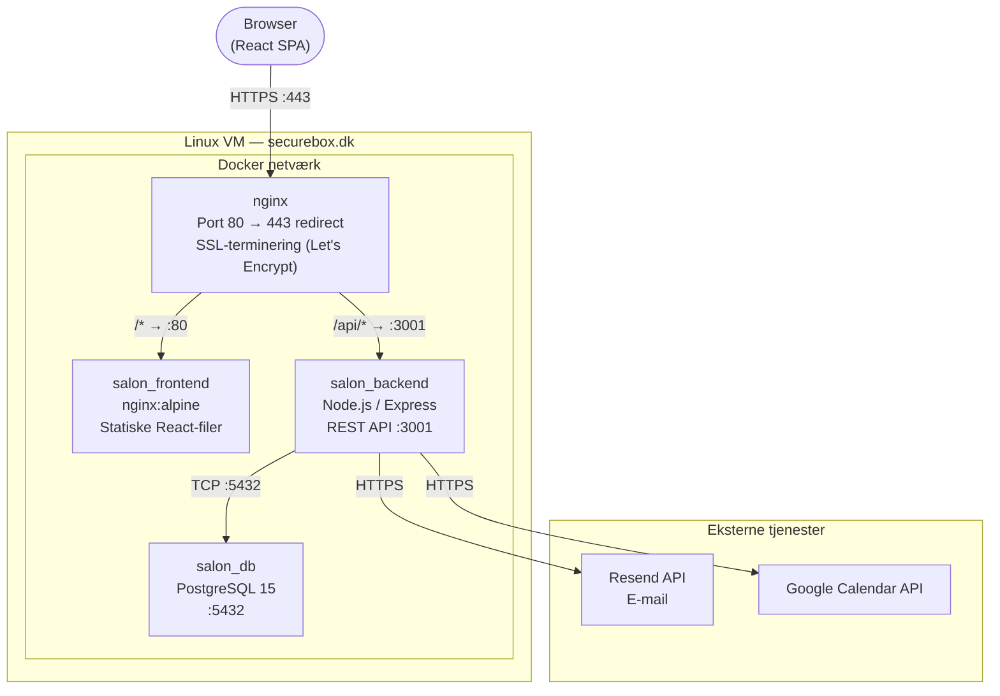
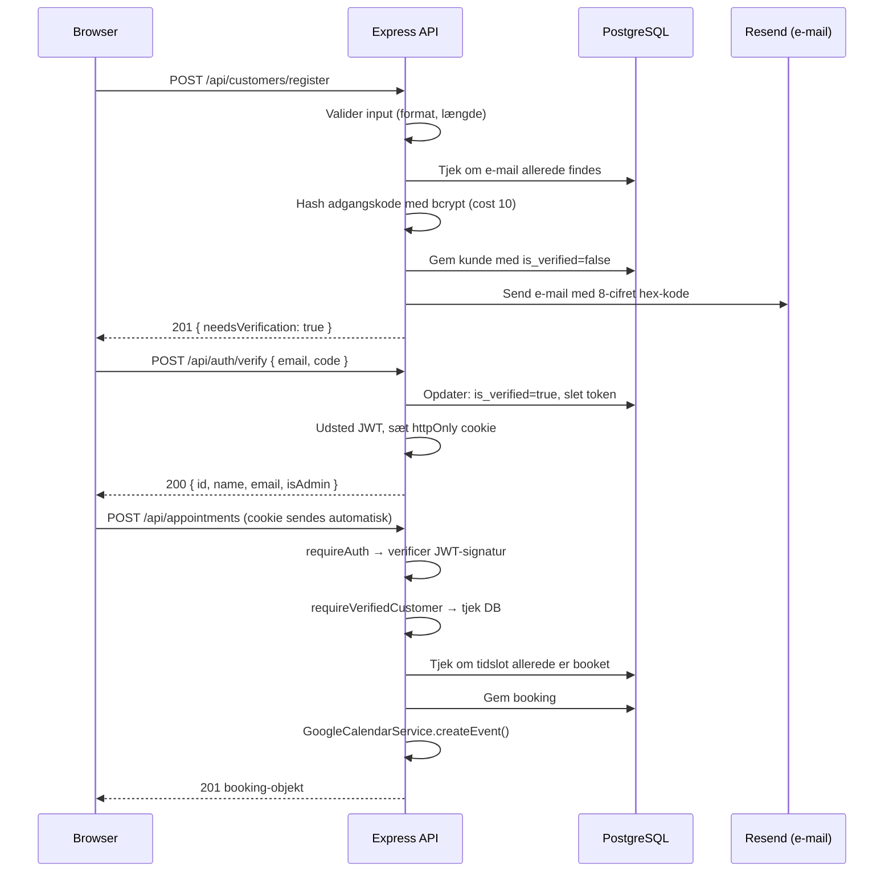
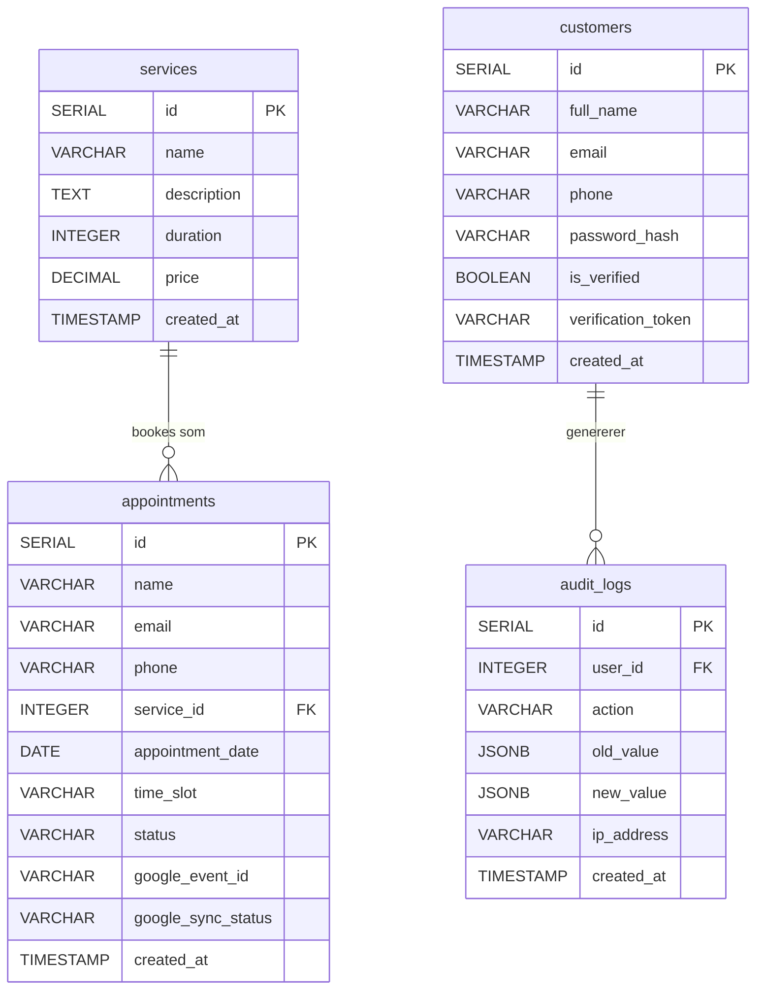
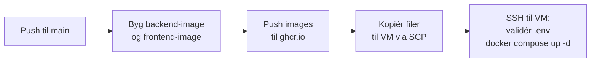

# Nordisk Hår — Online Bookingsystem

**Afsluttende Eksamensprojekt**

| | |
|---|---|
| **Dato** | [DD]/[måned]/2026 |
| **Studerendes navn** | [Dit navn] |
| **Studerendes e-mail** | [Din e-mail] |
| **Institution** | UCL Erhvervsakademi og Professionshøjskole |
| **Uddannelse** | IT Teknolog |
| **Vejleder** | [Vejleders navn] |
| **Antal tegn** | [Udfyldes til sidst] |

---

## Abstract

Denne rapport beskriver design og udvikling af et webbaseret bookingsystem til frisørsalonen "Nordisk Hår". Udgangspunktet er et problem som mange små servicevirksomheder kender: at håndtere tidsbestillinger manuelt via telefon og SMS er tidskrævende og fejlbehæftet. Formålet har været at udvikle en løsning, der giver kunder mulighed for at booke tider online, mens salonens ejer får et overblik over alle bookinger fra ét sted.

Systemet er bygget som en tre-lagsarkitektur med en React 18-frontend, en Node.js/Express REST API-backend og en PostgreSQL-database. Alle tre dele kører i Docker-containere og deployes automatisk til en Linux-server via GitHub Actions. Sikkerhed er behandlet systematisk med udgangspunkt i OWASP Top 10 og resulteret i bl.a. JWT-autentifikation med httpOnly cookies, bcrypt-hashning af adgangskoder, e-mailverifikation og rate limiting.

Resultatet er et fuldt fungerende og produktionsdeploy et system tilgængeligt over HTTPS, komplet med et administrationspanel og automatisk synkronisering til Google Kalender. Alle opstillede krav er opfyldt med undtagelse af en planlagt medarbejderrolle, som er nedprioriteret til fremtidig videreudvikling.

---

## Indholdsfortegnelse

1. Introduktion
2. Problemformulering
3. Teoretisk fundament
4. Metodologi
5. Resultater og analyse
6. Diskussion
7. Perspektivering
8. Konklusion
9. Referencer

---

## 1. Introduktion

Mange mindre servicevirksomheder — frisørsaloner, kliniker, håndværkere — håndterer tidsbestillinger på den samme måde som for 30 år siden: kunden ringer op eller sender en SMS, og salonen noterer det i en papirkalender eller et regneark. Det fungerer, men det kræver at nogen er tilgængelig til at svare, og det giver ingen mulighed for at se ledige tider udefra.

For frisørsalonen "Nordisk Hår" er udgangspunktet det samme. Salonen tilbyder seks ydelser — klipning, farvning, skæg og styling — og ønsker at gøre det muligt for kunder at booke tider online uden at skulle ringe. Salonens ejer skal samtidig kunne se alle bookinger samlet og have dem synkroniseret til sin Google Kalender, så intet falder mellem to stole.

Dette projekt løser problemet ved at udvikle et komplet webbaseret bookingsystem fra bund, kombineret med et dedikeret netværkssikkerhedslag. Det webbaserede system er deployeret og tilgængeligt på `securebox.dk`. Derudover er der bygget en netværkssikkerhedsgateway baseret på en Raspberry Pi 4, der kører OpenWrt — et Linux-baseret routeroperativsystem. Denne enhed sidder mellem salonens internetforbindelse og det interne netværk og fungerer som et aktivt sikkerhedsfilter, der segmenterer netværket i adskilte zoner, blokerer malware og tracking på DNS-niveau og krypterer DNS-opslag.

Som det beskrives i problemformuleringen, er fokus ikke kun på bookingfunktionaliteten i sig selv, men på at sikre hele den infrastruktur der omgiver systemet — fra netværkslaget og op til applikationslaget.

---

## 2. Problemformulering

Mange små servicevirksomheder mangler et digitalt værktøj til at håndtere tidsbestillinger, hvilket medfører afhængighed af telefonisk kontakt og risiko for dobbeltbookinger og tabte aftaler.

**Hvordan kan der udvikles et sikkert og driftklart online bookingsystem til en frisørsalon, der giver kunder mulighed for at oprette konto og booke tider, mens salonens ejer kan administrere bookinger og se dem i Google Kalender — og som understøttes af et dedikeret netværkssikkerhedslag med segmentering, DNS-filtrering og krypteret internettrafik?**

---

## 3. Teoretisk fundament

### 3.1 Systemarkitektur

Systemet er bygget som en **tre-lagsarkitektur**, også kaldet en N-tier arkitektur, der opdeler applikationen i lag med hvert sit ansvarsområde [5]. Hvert lag må kun kommunikere med laget direkte ved siden af sig — frontend taler med backend, backend taler med databasen, men frontend har aldrig direkte adgang til databasen. Det gør systemet nemmere at vedligeholde og sikrer at et lag kan udskiftes uden at de andre skal ændres.

De tre lag er:
- **Præsentationslaget** — React-applikationen der kører i brugerens browser
- **Applikationslaget** — Node.js/Express API'et der håndterer al forretningslogik
- **Datalaget** — PostgreSQL-databasen der gemmer al data

En fjerde komponent — en **nginx reverse proxy** — sidder foran systemet som det eneste indgangspunkt fra omverdenen. Hverken API'et eller databasen har åbne porte mod internettet.

**Figur 1: Systemarkitektur**



**Tabel 1: Teknologistack — webapplikation**

| Komponent | Teknologi | Vigtigste begrundelse |
|---|---|---|
| Frontend | React 18 | SPA-arkitektur, komponentbaseret, stor community |
| Backend | Node.js + Express | Asynkron I/O, velegnet til REST APIs |
| Database | PostgreSQL 15 | ACID-garantier, JSONB til audit log |
| Web server | nginx | Reverse proxy, SSL-terminering, høj ydeevne |
| Containerisering | Docker + Compose | Reproducerbart miljø fra dev til produktion |
| CI/CD | GitHub Actions | Integreret i GitHub, gratis, veldokumenteret |
| E-mail | Resend API | Moderne transaktionel e-mail, gratis niveau |
| Kalender | Google Calendar API v3 | Bred adoption, stabil og veldokumenteret |

**Tabel 2: Teknologistack — netværkssikkerhed**

| Komponent | Teknologi | Vigtigste begrundelse |
|---|---|---|
| Gateway-hardware | Raspberry Pi 4 Model B | Billig, kraftig nok, fuld softwarekontrol |
| Router-OS | OpenWrt 23.05 | Open source Linux, enterprise-funktioner |
| Firewall | nftables (via OpenWrt) | Zone-baseret, moderne, standard i Linux-kernen |
| DNS-server | Dnsmasq | Let og integreret i OpenWrt |
| DNS-filtrering | luci-app-adblock + OISD Big XXL | 100.000+ domæner blokeret netværksbredt |
| DNS-kryptering | https-dns-proxy (DoH) | Krypterer DNS-opslag, skjuler historik fra ISP |
| Trafikovervågning | nlbwmon | Layer 7 båndbreddeovervågning per enhed |

### 3.2 HTTP og REST

Al kommunikation mellem browser og server sker over **HTTP (HyperText Transfer Protocol)** — den protokol der definerer hvordan en browser beder om noget, og hvordan serveren svarer [6]. En HTTP-forespørgsel består af en **metode** (hvad vil du gøre), en **sti** (hvad vil du gøre det med) og evt. en **body** (de data du sender med).

De fire metoder der bruges i dette projekt er:

| Metode | Betydning | Eksempel |
|---|---|---|
| `GET` | Hent data | Hent liste over ydelser |
| `POST` | Opret noget nyt | Opret en booking |
| `PATCH` | Opdater en del af noget | Skift en bookings status |
| `DELETE` | Slet noget | (bruges ikke i dette projekt) |

Serveren svarer altid med en **statuskode** der kort fortæller om det gik godt eller ej. Koder i 200-serien betyder succes, 400-serien betyder at klienten sendte noget forkert, og 500-serien betyder at noget gik galt på serveren. Eksempler: `200 OK`, `201 Created`, `400 Bad Request`, `401 Unauthorized`, `403 Forbidden`, `409 Conflict`, `429 Too Many Requests`.

**REST (Representational State Transfer)** er en arkitekturstil for hvordan man designer et API [5]. Et REST API er **stateless**, hvilket vil sige at serveren ikke husker noget mellem forespørgsler — hver forespørgsel skal indeholde al den information serveren behøver for at svare. Det er derfor JWT-tokenet sendes med i en cookie ved hvert kald, frem for at serveren holder en session i hukommelsen.

### 3.3 HTTPS og TLS

**HTTPS** er HTTP med et lag af kryptering ovenpå. Krypteringen leveres af **TLS (Transport Layer Security)**, der sikrer at al data mellem browser og server er krypteret, så ingen der sidder imellem kan læse eller ændre indholdet [7].

TLS fungerer ved hjælp af et **SSL-certifikat** — en fil der beviser at serveren rent faktisk ejer det domæne den udgiver sig for at eje. Certifikatet udstedes af en betroet tredjepart kaldet en **Certificate Authority (CA)**. I dette projekt bruges **Let's Encrypt** som CA — det er en gratis, automatiseret CA der er bredt anerkendt i industrien.

Når en browser kontakter serveren første gang, gennemføres et **TLS handshake**: browser og server aftaler hvilken krypteringsalgoritme de vil bruge, og serveren fremlægger sit certifikat. Derefter er al kommunikation krypteret. Kun TLS-version 1.2 og 1.3 tillades — ældre versioner har kendte sikkerhedshuller og er slået fra.

HTTP-trafik på port 80 omdirigeres automatisk til HTTPS på port 443 med en `301 Moved Permanently`-statuskode, så ingen data nogensinde sendes i klartekst.

### 3.4 Containerisering med Docker

**Docker** er et system til at pakke en applikation og alle dens afhængigheder ind i en isoleret enhed kaldet en **container** [8]. En container er ikke en virtuel maskine — den deler operativsystemets kerne med de andre containere — men den har sit eget filsystem, netværk og procesrum. Det betyder at en container kører ens uanset om den er på en udviklerbærbar, en testserver eller en produktionsserver.

Et **Docker image** er opskriften på en container: en beskrivelse af hvilken software der skal installeres og hvilken kommando der skal køres. Et image bygges én gang og kan derefter startes som mange containere. I dette projekt er der to brugerdefinerede images (frontend og backend) og to standard images (PostgreSQL og nginx).

**Docker Compose** er et orkestreringsværktøj der giver mulighed for at definere og starte flere containere på én gang via en enkelt konfigurationsfil (`docker-compose.yml`). Compose håndterer også det interne netværk mellem containerne, rækkefølgen de starter i, og hvilke porte der er eksponeret mod omverdenen.

En vigtig forskel: `ports` i Compose åbner en port mod omverdenen (internettet), mens `expose` kun gør porten tilgængeligt for andre containere i det interne netværk. Databasen og backend bruger `expose` — de er aldrig tilgængelige direkte udefra.

### 3.5 CI/CD og GitHub Actions

**CI/CD** står for *Continuous Integration / Continuous Delivery* — et princip om at kodeændringer automatisk bygges, testes og deployes, frem for at det sker manuelt [9].

**GitHub Actions** er GitHubs indbyggede CI/CD-platform. Man definerer en **workflow** i en YAML-fil i projektet, der beskriver hvilke trin der skal køres automatisk. En workflow trigges typisk af en bestemt hændelse — f.eks. at kode pushes til en bestemt branch.

**GitHub Container Registry (ghcr.io)** er en del af GitHub og fungerer som et lager for Docker images. Images bygges i pipelinen og gemmes her, så produktionsserveren kan hente dem uden at skulle bygge dem på stedet.

**GitHub Secrets** er krypterede nøgle-værdi-par der er gemt sikkert i GitHub og kan bruges i workflows. De bruges til at injicere følsomme oplysninger som adgangskoder og API-nøgler ind i pipelinen, uden at de nogensinde står skrevet i kildekoden.

### 3.6 Autentifikation: JWT og httpOnly cookies

**Autentifikation** er processen der verificerer at en bruger er den, de udgiver sig for at være — typisk via brugernavn og adgangskode. **Autorisation** er det efterfølgende spørgsmål: hvad har denne bruger lov til at gøre? De to begreber forveksles ofte men er adskilte.

**JWT (JSON Web Token)** er en åben standard (RFC 7519) [3] for at udveksle information sikkert som et kompakt, URL-sikkert token. Et JWT består af tre Base64-kodede dele adskilt af punktummer:

1. **Header** — hvilken algoritme der bruges til signering (typisk `HS256`)
2. **Payload** — de data tokenet indeholder (bruger-ID, roller, udløbstid)
3. **Signature** — en kryptografisk signatur der beviser at tokenet ikke er ændret

Signaturen beregnes ved at kombinere header og payload med en hemmelig nøgle (`JWT_SECRET`) der kun kendes af serveren. Når serveren modtager et token, beregner den signaturen igen og sammenligner — passer de ikke, er tokenet ugyldigt eller manipuleret.

Tokenet gemmes i en **httpOnly cookie**. `HttpOnly` er et flag der fortæller browseren at JavaScript-kode på siden ikke må læse denne cookie. Det beskytter mod **XSS-angreb (Cross-Site Scripting)**, hvor ondsindet JavaScript forsøger at stjæle session-tokens. Cookies sendes automatisk med i alle HTTP-forespørgsler til det samme domæne, så tokenet altid er med uden at frontend-koden eksplicit skal håndtere det.

### 3.7 Adgangskodehashning med bcrypt

En adgangskode må aldrig gemmes i klartekst i en database. Hvis databasen kompromitteres, ville alle brugeres adgangskoder straks være kendte. Løsningen er **hashning** — en envejsfunktion der omdanner adgangskoden til en fast-length streng (et hash). Man kan ikke gå baglæns fra hashet til adgangskoden.

**bcrypt** [4] er en algoritme specielt designet til adgangskodehashning. Den adskiller sig fra generelle hashfunktioner som SHA-256 på to punkter:

- **Salt:** bcrypt tilføjer automatisk et tilfældigt salt til adgangskoden inden hashning. Det betyder at to brugere med samme adgangskode får forskellige hashes, og at forudberegnede **rainbow tables** (tabeller med millioner af kendte hashes) er ubrugelige.
- **Cost factor:** bcrypt har en justerbar "cost" (arbejdsfaktor) der bestemmer hvor mange beregningsrunder der køres. Cost factor 10 betyder 2¹⁰ = 1024 runder. Det gør det langsomt at beregne ét hash — for en bruger der logger ind mærkes det ikke, men for en angriber der prøver millioner af adgangskoder er det afgørende.

### 3.8 SQL Injection og parameteriserede queries

**SQL injection** er en angrebstype hvor en angriber indsætter SQL-kode i et inputfelt og derved manipulerer databaseforespørgsler [2]. Et klassisk eksempel: hvis man bygger en SQL-forespørgsel ved at sætte brugerinput direkte ind i strengen, kan en angriber skrive `' OR '1'='1` og omgå login-tjekket.

Løsningen er **parameteriserede queries** (også kaldet prepared statements): i stedet for at sætte data direkte ind i SQL-strengen, bruges pladsholdere (`$1`, `$2` osv.) og data sendes separat. Databasebiblioteket sikrer at data aldrig fortolkes som SQL-kode, uanset hvad brugeren har skrevet.

### 3.9 Rate limiting og brute force-beskyttelse

**Brute force** er en angrebstype hvor en angriber automatisk prøver tusindvis af adgangskoder for at gætte den rigtige. **Rate limiting** er en modforanstaltning der begrænser hvor mange forespørgsler en klient må sende inden for en given tidsperiode [2]. Overskrides grænsen, returneres statuskode `429 Too Many Requests`.

**Fail2ban** er et serverprogram der overvåger logfiler og automatisk blokerer IP-adresser der genererer mange fejlede forespørgsler. Det fungerer på netværksniveau (via firewall-regler) og er et supplement til rate limiting i applikationslaget.

### 3.10 PostgreSQL og ACID

**PostgreSQL** er en open source relationsdatabase der organiserer data i tabeller med rækker og kolonner, og understøtter relationer mellem tabeller via fremmednøgler [10].

**ACID** er et sæt garantier for databasetransaktioner:
- **Atomicity** — en transaktion gennemføres helt eller slet ikke
- **Consistency** — databasen er altid i en gyldig tilstand
- **Isolation** — samtidige transaktioner påvirker ikke hinanden
- **Durability** — en gennemført transaktion overlever servernedbrud

I et bookingsystem er ACID kritisk: det er ikke acceptabelt at en booking delvist registreres eller at to brugere kan booke samme tidslot på grund af et race condition.

**JSONB** er PostgreSQLs binære JSON-kolonneformat. Det giver mulighed for at gemme fleksibelt struktureret data — nyttigt i audit-loggen, hvor hver hændelsestype har sine egne felter — og understøtter indeksering og forespørgsler direkte på JSON-indholdet.

### 3.11 Kravspecifikation — MoSCoW

Kravene er prioriteret med **MoSCoW-metoden** [1], der deler krav i fire niveauer: *Must have* (skal med), *Should have* (bør med), *Could have* (hvis der er tid) og *Won't have* (ikke i denne version). Metoden tvinger en eksplicit prioritering, der sikrer at de mest værdiskabende funktioner leveres først.

**Tabel 1: Funktionelle krav**

| Prioritet | Krav |
|---|---|
| Must have | Kunder kan oprette konto og logge ind |
| Must have | E-mailverifikation ved kontooprettelse |
| Must have | Kunder kan se ydelser og booke ledige tider |
| Must have | Admin kan se og administrere alle bookinger |
| Must have | Data gemmes persistent i en database |
| Should have | Automatisk synkronisering til Google Kalender |
| Should have | Audit log over alle vigtige handlinger |
| Should have | Systemet er tilgængeligt over HTTPS i produktion |
| Should have | Netværket segmenteres i adskilte zoner (admin og gæst) |
| Should have | DNS-filtrering og krypterede DNS-opslag på netværksniveau |
| Could have | Rollebaseret adgang for medarbejdere |
| Could have | Kunder kan se og annullere egne bookinger |
| Won't have | Betalingsintegration |
| Won't have | Dedikeret mobilapp |

**Tabel 2: Ikke-funktionelle krav**

| Kategori | Krav |
|---|---|
| Sikkerhed | Adgangskoder hashes med bcrypt (cost factor 10) |
| Sikkerhed | JWT-tokens gemmes i httpOnly cookies |
| Sikkerhed | Alle SQL-forespørgsler er parameteriserede |
| Sikkerhed | Rate limiting på login-endpoints (5 forsøg/time) |
| Driftsikkerhed | Reproducerbart deployment med Docker Compose |
| Vedligeholdelse | Kode opdelt i tydelige lag (frontend/backend/database) |

### 3.12 OWASP Top 10

**OWASP (Open Web Application Security Project)** er en non-profit organisation der udgiver vejledninger og standarder for websikkerhed [2]. Deres **Top 10** er en liste over de ti mest udbredte og kritiske sikkerhedsrisici i webapplikationer, opdateret hvert tredje til fjerde år baseret på data fra industrien.

De kategorier der er relevante for dette projekt og adresseres i løsningen:

| OWASP kategori | Hvad risikoen er |
|---|---|
| A01 – Broken Access Control | Brugere tilgår data eller funktioner de ikke har ret til |
| A02 – Cryptographic Failures | Følsomme data transmitteres eller gemmes uden kryptering |
| A03 – Injection | Angriber manipulerer databaseforespørgsler via input |
| A05 – Security Misconfiguration | Fejlkonfigureret server eksponerer unødvendige porte eller data |
| A07 – Identification & Auth Failures | Svag autentifikation eller manglende kontosikring |
| A09 – Security Logging & Monitoring | Manglende logning gør angreb usynlige |

### 3.13 CORS og CSRF

**CORS (Cross-Origin Resource Sharing)** er en sikkerhedsmekanisme der kontrollerer hvilke domæner der må sende API-forespørgsler til serveren fra en browser [6]. Som standard blokerer browseren forespørgsler fra et andet domæne — f.eks. må `ondtsite.dk` ikke sende forespørgsler til `securebox.dk/api` på vegne af en bruger. Serveren kan eksplicit tillade specifikke domæner via `Access-Control-Allow-Origin`-headeren i svaret.

Hvis CORS konfigureres forkert — f.eks. med `*` (tillad alle) — kan et ondsindet website sende forespørgsler til API'et på vegne af en logget-ind bruger og derved læse eller ændre data. I dette projekt er CORS begrænset til præcis ét tilladt domæne (`CORS_ORIGIN`).

**CSRF (Cross-Site Request Forgery)** er et relateret angreb hvor en ondsindet hjemmeside får en brugers browser til at sende en forespørgsel til en anden side, som brugeren er logget ind på. Traditionelt fungerer det ved at browseren automatisk medsender cookies — men cookie-attributten `SameSite: lax` forhindrer cookies i at blive sendt med cross-site forespørgsler initieret af tredjepartsider. Det er en af grundene til at JWT-tokenet er gemt i en cookie med `SameSite: lax` frem for f.eks. et custom header.

### 3.14 Defense in depth

**Defense in depth** (dybdesikring) er et sikkerhedsprincip der siger at man ikke bør stole på ét enkelt sikkerhedslag, men i stedet have flere uafhængige lag der hver for sig bremser eller opdager et angreb [2]. Hvis ét lag fejler eller omgås, er der stadig et andet lag i vejen.

I dette projekt er forsvar opbygget i tre niveauer:

- **Netværksniveau:** Fail2ban blokerer IP-adresser med mange fejlede forespørgsler direkte i firewallen. Kun port 80 og 443 er åbne mod internettet.
- **Applikationsniveau:** Rate limiting begrænser loginhastighedhed, middleware tjekker JWT og roller, parameteriserede queries forhindrer SQL injection, CORS begrænser hvilke sider der må kalde API'et.
- **Datalagniveau:** Adgangskoder gemmes som bcrypt-hashes, databasen er kun tilgængelig internt i Docker-netværket, og sensitive konfigurationsværdier gemmes i miljøvariabler — aldrig i kodebasen.

### 3.15 Audit logging

En **audit log** er en kronologisk registrering af hvem der har gjort hvad i systemet og hvornår. Det er en central del af **OWASP A09 (Security Logging and Monitoring Failures)**, der peger på at mange sikkerhedshændelser ikke opdages i tide, fordi systemet simpelthen ikke logger nok information.

En god audit log registrerer mindst: tidsstemplet, identiteten på brugeren (eller IP-adressen hvis brugeren er ukendt), hvilken handling der blev udført, og hvad det berørte. I dette system logges desuden "before/after"-tilstanden ved ændringer — f.eks. hvad en bookings status var *inden* en admin ændrede den, og hvad den er *efter*. Det giver mulighed for at rekonstruere en hændelsessekvens i tilfælde af fejl eller misbrug.

### 3.16 Miljøvariabler og hemmeligheder

**Miljøvariabler** er nøgle-værdi-par der sættes i operativsystemet og kan læses af applikationen. De bruges til at adskille konfiguration fra kode — f.eks. at databaseadgangskoden ikke er skrevet direkte i `server.js`, men læses fra miljøet ved opstart. Det følger **Twelve-Factor App**-princippet om at konfiguration altid bør komme fra miljøet, ikke fra koden.

Det er kritisk at følsomme miljøvariabler — `JWT_SECRET`, databaseadgangskoder, API-nøgler — aldrig havner i versionsstyring (Git). En utilsigtet commit af en `.env`-fil med rigtige credentials er et hyppigt sikkerhedsproblem i industrien. I dette projekt er `.env` listet i `.gitignore`, og production-credentials lever udelukkende som GitHub Secrets og på serverens filsystem.

### 3.17 E-mailverifikation som sikkerhedsmekanisme

E-mailverifikation ved kontooprettelse tjener to formål. For det første bekræfter det at den e-mail der opgives faktisk tilhører personen der opretter kontoen — det forhindrer at nogen opretter en konto med en andens e-mail. For det andet udgør det en ekstra barriere mod automatiseret misbrug (bots der masseregistrerer konti), fordi en bot normalt ikke har adgang til de e-mail-konti den opgiver.

I dette system genereres en tilfældig 8-tegns hexadecimal kode (`crypto.randomBytes(4).toString('hex')`) der sendes til brugerens e-mail og gemmes midlertidigt i databasen. Koden er kort nok til at en bruger nemt kan skrive den ind, men lang nok til at tilfældig gætning er upraktisk (16⁸ = ca. 4 milliarder kombinationer). Koden slettes fra databasen så snart den er brugt.

### 3.18 Zero Trust og Security by Design

**Zero Trust** er et sikkerhedsprincip der siger at intet — hverken enheder, brugere eller netværkstrafik — per definition er betroet, blot fordi det befinder sig inden for et netværks grænser [2]. Det er en reaktion på den traditionelle "castle-and-moat"-tilgang, hvor alt inden for netværket antages at være sikkert. I stedet verificeres al adgang eksplicit, uanset om forespørgslen kommer udefra eller indefra.

**Security by Design** er et relateret princip om at sikkerhed ikke skal tilføjes som et lag ovenpå et færdigt system, men tænkes ind fra første designbeslutning. Det betyder at arkitekturen i sig selv begrænser angrebsfladen — f.eks. at en database aldrig er tilgængelig direkte fra netværket, selvom der ikke er nogen aktuel trussel der kræver det.

I dette projekt er begge principper anvendt: på netværksniveau via VLAN-segmentering og en dedikeret firewall, og på applikationsniveau via middleware-kæder, parameteriserede queries og httpOnly cookies.

### 3.19 Netværkssegmentering og VLAN

**Netværkssegmentering** er teknikken at opdele et netværk i adskilte zoner, så kompromittering af én zone ikke automatisk giver adgang til de andre [2]. I et typisk hjemme- eller kontornetværk er alle enheder på ét fladt netværk — en printer, en smart-TV, en laptop og en server kan alle se og kontakte hinanden direkte.

**VLAN (Virtual Local Area Network)** er en softwarebaseret metode til at oprette logisk adskilte netværk over den samme fysiske infrastruktur. Enheder på VLAN 10 kan ikke kommunikere direkte med enheder på VLAN 20 uden at trafikken passerer igennem routerens firewall, der eksplicit tillader eller afviser den. Det er langt billigere end at købe separat fysisk hardware til hvert segment.

**Lateral movement** er en angrebsteknik hvor en angriber, efter at have kompromitteret én enhed på et netværk, bevæger sig sideways til andre enheder. VLAN-segmentering forhindrer dette ved at begrænse hvilke enheder der overhovedet kan "se" hinanden. Et hacket IoT-kamera på gæstenetværket kan ikke kontakte en server på admin-netværket, fordi de er på separate VLANs med en firewall imellem.

### 3.20 DNS Sinkhole og DNS over HTTPS

**DNS (Domain Name System)** er internettets telefonbog — det oversætter domænenavne som `facebook.com` til IP-adresser. Hvert gang en enhed på netværket forsøger at kontakte et domæne, sendes en DNS-forespørgsel. Et **DNS Sinkhole** er en DNS-server der bevidst returnerer et forkert svar for kendte ondsindede domæner — i stedet for den rigtige IP returneres f.eks. `0.0.0.0`, så forbindelsen aldrig oprettes. Det er et effektivt forsvar fordi det virker *inden* forbindelsen er oprettet, på alle enheder på netværket på én gang — også enheder der ikke kan have software installeret på dem (printere, smart-TV'er osv.).

**DNS over HTTPS (DoH)** løser et privatlivsproblem: traditionelle DNS-forespørgsler sendes i klartekst på port 53. Det betyder at en internetudbyder (ISP) eller en angriber der kan overvåge netværkstrafikken kan se præcis hvilke domæner en bruger besøger — selv om selve browsingsessionen er krypteret med HTTPS. DoH pakker DNS-forespørgsler ind i en normal HTTPS-forbindelse på port 443, så de ser ud som al anden krypteret internettrafik og ikke kan skelnes fra hinanden.

### 3.21 Zone-baseret firewall og nftables

En **zone-baseret firewall** organiserer netværksinterfaces i navngivne zoner (f.eks. `wan`, `lan`, `guest`) og definerer politikker for trafik imellem dem. Frem for at skrive regler for hvert enkelt interface og IP-adresse, skrives regler som "trafik fra `guest` til `lan` afvises". Det gør konfigurationen mere overskuelig og reducerer risikoen for fejl.

**nftables** er det moderne Linux-firewallrammeværk der erstatter de ældre `iptables`. Det er det underliggende system i OpenWrt 23.05 og bruges til at håndhæve zone-politikkerne. Standardpolitikken i dette setup er **drop** — al indkommende trafik fra internettet afvises medmindre den er en svar på en forbindelse der er initieret indefra (*established/related*).

**UPnP (Universal Plug and Play)** er en protokol der giver enheder på netværket lov til selv at åbne porte i firewallen uden brugerens vidende. Det er en alvorlig sårbarhed — malware der kører på én enhed kan bruge UPnP til at åbne en bagdør direkte ind i netværket. UPnP er deaktiveret.

---

## 4. Metodologi

### 4.1 HTTPS og nginx i praksis

Som beskrevet i teoriafsnittet om HTTPS termineres krypteringen i nginx-containeren. nginx er konfigureret med to server-blokke: én der lytter på port 80 og omdirigerer al HTTP-trafik til HTTPS, og én der lytter på port 443 og håndterer den krypterede trafik.

SSL-certifikaterne er placeret i mappen `certbot/conf` på serveren og monteres ind i nginx-containeren som et Docker volume. Let's Encrypt udsteder certifikater med 90 dages gyldighed. Fornyelse sker manuelt via et script på serveren, da automatisk fornyelse med Certbot kræver at port 80 er tilgængelig under fornyelsesprocessen.

nginx er konfigureret til kun at acceptere **TLS 1.2 og 1.3**, da tidligere versioner (TLS 1.0 og 1.1) har kendte kryptografiske svagheder og er forældet.

nginx fungerer desuden som en **reverse proxy**, der fordeler indkommende forespørgsler baseret på URL-stien: forespørgsler til `/api/*` videresendes til backend-containeren på port 3001, og alle andre forespørgsler (`/`) videresendes til frontend-containeren på port 80. nginx sætter headerne `X-Real-IP` og `X-Forwarded-For` på alle videresendte forespørgsler, så backend kan se den rigtige klient-IP frem for nginx's interne IP.

### 4.2 REST API-design og middleware

Backend er bygget med **Express**, som er et minimalistisk Node.js-webframework. Al forretningslogik er samlet i én fil (`server.js`) og eksponerer et REST API med følgende endpoints:

**Tabel 3: API-endpoints**

| Metode | Endpoint | Adgang | Funktion |
|---|---|---|---|
| GET | `/api/health` | Alle | Systemtjek — bruges af Docker healthcheck |
| GET | `/api/services` | Alle | Hent ydelseslisten |
| GET | `/api/availability/:date` | Alle | Hent booket tidslots for en dato |
| POST | `/api/customers/register` | Alle | Opret konto |
| POST | `/api/auth/verify` | Alle | Bekræft e-mail med kode |
| POST | `/api/login` | Alle | Log ind |
| POST | `/api/logout` | Alle | Log ud (ryd cookie) |
| GET | `/api/me` | Logget ind | Hent aktuel bruger fra cookie |
| POST | `/api/appointments` | Verificeret bruger | Opret booking |
| GET | `/api/admin/appointments` | Admin | Hent alle bookinger |
| PATCH | `/api/admin/appointments/:id` | Admin | Opdater bookingstatus |
| GET | `/api/admin/system-status` | Admin | Containerstatus og backup |
| GET | `/api/admin/backup/logs` | Admin | Vis backup-logfil |

Adgangskontrol håndteres med tre **middleware**-funktioner — funktioner der kører *inden* selve endpoint-handleren og kan afbryde forespørgslen hvis betingelserne ikke er opfyldt:

- `requireAuth` — læser JWT-tokenet fra cookien og verificerer signaturen. Returnerer `401 Unauthorized` hvis tokenet mangler eller er ugyldigt.
- `requireAdmin` — tjekker at `isAdmin`-flaget i det verificerede token er `true`. Returnerer `403 Forbidden` hvis ikke.
- `requireVerifiedCustomer` — slår op i databasen og bekræfter at kundens `is_verified` er `true`. Returnerer `403 Forbidden` med koden `NOT_VERIFIED` hvis ikke.

Et endpoint kan kæde flere middleware sammen: `POST /api/appointments` kræver både `requireAuth` og `requireVerifiedCustomer` — begge skal godkende forespørgslen, inden bookingen oprettes.

### 4.3 JWT-implementering

Når en bruger logger ind eller bekræfter sin e-mail, kalder backend funktionen `signAndSetToken`. Her oprettes JWT-tokenet med `jsonwebtoken`-biblioteket:

```javascript
const payload = {
  id: user.id,
  name: user.full_name,
  email: user.email,
  isAdmin,       // true hvis e-mail matcher ADMIN_EMAIL i .env
  isVerified,    // true hvis is_verified = true i databasen
};

const token = jwt.sign(payload, JWT_SECRET, { expiresIn: '7d' });
```

`JWT_SECRET` er en lang, tilfældig streng gemt i `.env`-filen — aldrig i kildekoden. Tokenet er gyldigt i 7 dage. Det sættes som en `httpOnly` cookie med flagene `Secure` (kun HTTPS) og `SameSite: lax` (forhindrer CSRF-angreb fra andre domæner):

```javascript
res.cookie('auth_token', token, {
  httpOnly: true,
  secure: true,     // kun sendt over HTTPS
  sameSite: 'lax',
  maxAge: 7 * 24 * 60 * 60 * 1000,
});
```

Når `requireAuth` modtager en forespørgsel, læser den cookien og verificerer signaturen med den samme `JWT_SECRET`. Passer signaturen ikke, eller er tokenet udløbet, returneres `401`.

### 4.4 Autentifikationsflow

Nedenstående diagram viser det fulde forløb fra kontooprettelse til en booking er gennemført:

**Figur 2: Autentifikationsflow**



### 4.5 Adgangskodehashning med bcrypt i koden

Ved kontooprettelse hashes adgangskoden inden den gemmes:

```javascript
const passwordHash = await bcrypt.hash(password, 10);
// 10 = cost factor — 2^10 = 1024 runder
```

Ved login sammenlignes den indtastede adgangskode med det gemte hash:

```javascript
const match = await bcrypt.compare(password, user.password_hash);
if (!match) {
  return res.status(401).json({ error: 'Forkert e-mail eller adgangskode' });
}
```

`bcrypt.compare` beregner hashet af den indtastede adgangskode med det salt der er indlejret i det gemte hash og sammenligner. Det er den eneste måde at verificere adgangskoden — man kan ikke dekryptere det gemte hash.

### 4.6 SQL injection-beskyttelse i praksis

Alle databaseforespørgsler i `server.js` bruger `pg`-bibliotekets parameteriserede queries. Brugerinput sættes aldrig direkte ind i SQL-strengen:

```javascript
// Korrekt — parameteriseret
const result = await pool.query(
  'SELECT id FROM customers WHERE lower(email) = lower($1)',
  [email]   // email sendes separat — fortolkes aldrig som SQL
);

// Forkert (bruges IKKE i projektet) — sårbar over for SQL injection
const result = await pool.query(
  `SELECT id FROM customers WHERE email = '${email}'`
);
```

### 4.7 Rate limiting i koden

To separate rate limiters er implementeret med `express-rate-limit`-biblioteket. Den ene gælder generelt for alle `/api`-endpoints, den anden er strengere og kun på login og verifikation:

```javascript
const authLimiter = rateLimit({
  windowMs: 60 * 60 * 1000,  // 1 time
  limit: 5,                   // maks 5 forsøg
  message: { error: 'For mange loginforsøg. Prøv igen senere.' },
});

app.post('/api/login', authLimiter, ...);
app.post('/api/auth/verify', authLimiter, ...);
```

Overskrides grænsen returneres HTTP `429 Too Many Requests`. Fail2ban på serveren overvåger nginx's access-log og blokerer på IP-niveau i firewallen, hvis en IP genererer mange 4xx-fejl.

### 4.8 Databasedesign

Databasen initialiseres automatisk via `init.sql` ved første opstart. Fire tabeller udgør datamodellen:

**Figur 3: ER-diagram**



`appointments` gemmer kundens kontaktoplysninger direkte på bookingen — ikke kun en reference til `customers`. Det sikrer at bookinghistorikken forbliver komplet selv hvis en kundekonto slettes. Bookinger slettes aldrig fra databasen; de annulleres ved at sætte `status = 'cancelled'`.

Tre indekser er oprettet på `audit_logs` for at holde opslagstiden lav efterhånden som tabellen vokser med hvert login og hver booking:

```sql
CREATE INDEX idx_audit_logs_created_at ON audit_logs(created_at);
CREATE INDEX idx_audit_logs_entity     ON audit_logs(entity_type, entity_id);
CREATE INDEX idx_audit_logs_user_id    ON audit_logs(user_id);
```

### 4.9 Docker Compose og opstartsrækkefølge

Alle fire services er defineret i `docker-compose.yml`. Kun nginx har `ports` (80 og 443) mod omverdenen — de andre bruger `expose`, der kun åbner porten internt i Docker-netværket.

Opstartsrækkefølgen styres af `depends_on` kombineret med healthchecks:

```
db (pg_isready ✓) → backend (/api/health → 200 ✓) → frontend (started) → nginx (aktiv)
```

Backend har desuden sin egen retry-logik: ved opstart forsøger den at forbinde til PostgreSQL op til 5 gange med 2 sekunders pause, før den giver op. Det håndterer det scenarie hvor Docker-healthchecket er bestået, men databasen stadig er i gang med at køre `init.sql`.

### 4.10 CI/CD-pipeline med GitHub Actions

Deployment sker automatisk via en workflow-fil i `.github/workflows/deploy.yml`. Workflowet trigges ved push til `main`-branchen og kører på en GitHub-hosted Ubuntu-runner.

**Figur 4: CI/CD pipeline**



Inden `docker compose up` køres et valideringsscript på VM'en, der tjekker at alle påkrævede miljøvariabler er sat i `.env`-filen. Mangler en variabel, fejler deployment og loggen viser præcis hvilken variabel der mangler. Det forhindrer systemet i at starte op i en ufuldstændig tilstand.

Alle følsomme værdier — databaseadgangskode, `JWT_SECRET`, API-nøgler til Resend og Google — er gemt som **GitHub Secrets** og injiceres ind i workflowet under kørsel. De skrives aldrig i kildekoden eller i versionsstyringshistorikken.

### 4.11 Google Calendar-integration

Integrationen er implementeret i klassen `GoogleCalendarService` og bruger Google's officielle Node.js-bibliotek `googleapis`. Autentifikation sker via en **Service Account** — en maskinbruger oprettet i Google Cloud Console — med en RSA-privat nøgle gemt som miljøvariabel.

Service Account'en er givet adgang til `calendar.events`-scopet på salonens Google Kalender. Det er det minimale scope der er nødvendigt — Service Account'en kan kun oprette og slette events, ikke læse andre dele af kontoen (**principle of least privilege**).

Når en booking oprettes, bygges et event-objekt med titel (`[Ydelse] - [Kundenavn]`), start- og sluttidspunkt (beregnet ud fra ydelsens varighed), og kundeoplysninger i beskrivelsen. `google_event_id` gemmes på bookingen i databasen, så det kan bruges til at slette eventet igen ved annullering.

Synkroniseringsstatus spores i kolonnen `google_sync_status`:

| Status | Betydning |
|---|---|
| `pending` | Afventer synkronisering |
| `synced` | Event oprettet i Google Kalender |
| `failed` | Fejl under synkronisering (fejlbesked gemt i `google_sync_error`) |
| `cancelled` | Event slettet da booking blev annulleret |
| `disabled` | Integration er slået fra via `GOOGLE_CALENDAR_ENABLED=false` |

Synkroniseringen er designet til at fejle lydløst — en fejl i Google's API stopper ikke bookingen fra at blive gemt i databasen.

### 4.12 CORS-konfiguration i Express

CORS er konfigureret i Express med `cors`-middlewaren, der sættes op ved serverstart. Det tilladte origin hentes fra miljøvariablen `CORS_ORIGIN`, som i produktion er sat til `https://securebox.dk`:

```javascript
app.use(cors({
  origin: CORS_ORIGIN,   // kun forespørgsler fra dette domæne tillades
  credentials: true,     // tillad cookies i cross-origin forespørgsler
}));
```

`credentials: true` er nødvendigt fordi browseren normalt ikke sender cookies med cross-origin forespørgsler med mindre serveren eksplicit tillader det. Det er nødvendigt for at JWT-cookien automatisk medfølger API-kald fra frontend til backend, selvom de teknisk set kommunikerer via nginx (samme domæne, så det er i praksis same-origin).

### 4.13 Input-validering

Al brugerinput valideres i backend inden det behandles. Valideringen sker i to niveauer:

**Strukturel validering** sikrer at de påkrævede felter er til stede og har den rette form. Eksempel fra registrering:

```javascript
if (!name || !email || !phone || !password) {
  return res.status(400).json({ error: 'Alle felter skal udfyldes' });
}
if (!/^[^@]+@[^@]+\.[^@]+$/.test(email)) {
  return res.status(400).json({ error: 'Ugyldig e-mail' });
}
if (password.length < 8) {
  return res.status(400).json({ error: 'Adgangskoden skal være mindst 8 tegn' });
}
```

**Forretningslogisk validering** sker mod databasen — f.eks. at en e-mail ikke allerede er i brug, at en ydelse med det givne ID eksisterer, og at det ønskede tidslot ikke allerede er booket:

```javascript
const existingAppointment = await pool.query(
  `SELECT id FROM appointments
   WHERE appointment_date = $1 AND time_slot = $2 AND status = 'confirmed'`,
  [appointment_date, time_slot]
);
if (existingAppointment.rows.length > 0) {
  return res.status(409).json({ error: 'Denne tid er allerede booket' });
}
```

Validering er bevidst lagt i backend og ikke kun i frontend. Frontend-validering er en brugeroplevelsesoptimering — det er hurtigere at give feedback før et kald sendes — men kan omgås af en angriber der sender forespørgsler direkte til API'et. Kun backend-validering er sikkerhedsrelevant.

### 4.14 Audit log — implementering

Audit-logningen er implementeret som en klasse, `AuditService`, der injiceres i backend ved opstart og bruges i alle endpoints der udfører vigtige handlinger. Hvert kald til `auditService.logAction()` skriver en ny række til `audit_logs`-tabellen:

```javascript
await auditService.logAction({
  userId: req.user.id,
  action: 'APPOINTMENT_CREATED',
  entityType: 'appointment',
  entityId: appointment.id,
  newValue: appointment,          // snapshot af den oprettede booking
  ipAddress: getRequestIp(req),   // klientens IP-adresse
});
```

IP-adressen hentes via `getRequestIp()`, der tjekker `X-Forwarded-For`-headeren (sat af nginx) frem for den direkte socket-adresse. Det er nødvendigt fordi alle forespørgsler ankommer fra nginx's interne IP, ikke direkte fra klienten.

De handlingstyper der logges er: `CUSTOMER_REGISTERED`, `CUSTOMER_VERIFIED`, `LOGIN_SUCCESS`, `APPOINTMENT_CREATED`, `APPOINTMENT_STATUS_UPDATED`, `GOOGLE_EVENT_CREATE_SUCCESS`, `GOOGLE_EVENT_CREATE_FAILED`, `GOOGLE_EVENT_DELETE_SUCCESS` og `GOOGLE_EVENT_DELETE_FAILED`.

### 4.15 Frontend — arkitektur og session

Frontend-applikationen er en **Single Page Application (SPA)** bygget i React 18. En SPA indlæser ét HTML-dokument og håndterer al navigation i JavaScript uden at genindlæse siden. Det giver en hurtigere og mere app-lignende brugeroplevelse.

Applikationen er opbygget af fem React-komponenter med klart opdelte ansvarsområder:

| Komponent | Ansvar |
|---|---|
| `App.js` | Rodkomponent — session, routing og auth-modal |
| `Header.js` | Navigation, login/logout-knapper |
| `ServiceCard.js` | Visning af én ydelse med pris og varighed |
| `BookingForm.js` | Kalender, tidsvælger og booking-formular |
| `AdminDashboard.js` | Bookingsoversigt og systemstatus (kun admin) |
| `VerifyEmailModal.js` | Modal til e-mailverifikation |

Når applikationen indlæses, forsøger den straks at gendanne en eventuel session ved at kalde `GET /api/me`. Hvis der ligger en gyldig JWT-cookie i browseren, returnerer API'et brugerens oplysninger og applikationen fortsætter som logget ind. Hvis ikke returneres en fejl og brugeren betragtes som gæst. Det betyder at en bruger forbliver logget ind i op til 7 dage uden at skulle logge ind igen, selvom de lukker browseren.

### 4.16 Rollebaseret adgang — frontend og backend

Systemet skelner mellem tre tilstande en bruger kan befinde sig i:

1. **Ikke logget ind** — kan se ydelser og ledige tider, men ikke booke
2. **Logget ind, ikke verificeret** — kan ikke booke; vises en modal om at verificere e-mail
3. **Logget ind og verificeret** — kan booke tider
4. **Admin** — har desuden adgang til `/admin`-siden med al administrativ funktionalitet

Admin-ruten beskytter sig på to måder. I frontend tjekkes `currentUser.isAdmin` fra `GET /api/me`-kaldet: er det `false`, vises en "ingen adgang"-besked i stedet for dashboardet. Det er brugeroplevelsesmæssigt korrekt, men det er ikke en sikkerhedskontrol — en angriber kan omgå frontend-tjekket. Den reelle kontrol er i backend: alle `/api/admin/*`-endpoints kræver `requireAdmin`-middleware, der verificerer JWT-tokenet og tjekker `isAdmin`-flaget direkte. Selv hvis frontend-koden manipuleres, returnerer API'et `403 Forbidden`.

Dette er et vigtigt sikkerhedsprincip: **frontend-adgangskontrol er kun for brugervenlighed, backend-adgangskontrol er sikkerhedskritisk**.

### 4.17 Struktureret logging med Winston

Backend bruger **Winston** til struktureret server-logging. Winston skriver JSON-formaterede loglinjer til to separate filer: `combined.log` (alt) og `error.log` (kun fejl). Logfiler roteres dagligt med datobaserede filnavne.

Struktureret logging i JSON-format er væsentligt nemmere at behandle automatisk end fritekst-logs — det er muligt at filtrere, søge og alarmere på specifikke felter. Et eksempel på en logget fejl ser sådan ud:

```json
{
  "level": "error",
  "message": "Database connection failed",
  "retriesLeft": 4,
  "timestamp": "2026-05-07T10:23:41.002Z"
}
```

Logfilerne er tilgængelige for admin-brugeren via API-endpointet `GET /api/admin/backup/logs`, der læser logfilen direkte fra filsystemet og returnerer den til frontend-dashboardet.

### 4.18 Raspberry Pi som netværkssikkerhedsgateway — hardware

Som et ekstra sikkerhedslag i den samlede løsning er der opsat en **Raspberry Pi 4 Model B** som en dedikeret netværkssikkerhedsgateway. Enheden sidder fysisk mellem salonens internetforbindelse (routeren fra ISP) og det interne netværk, og al trafik ind og ud af netværket passerer igennem den.

Hardware-konfigurationen er som følger:

| Komponent | Specifikation |
|---|---|
| Platform | Raspberry Pi 4 Model B |
| CPU | Quad-Core ARM Cortex-A72, 1.5 GHz |
| RAM | 4–8 GB LPDDR4 |
| Primær netværksport (WAN) | Indbygget Gigabit Ethernet (eth0) |
| Sekundær netværksport (LAN) | TP-Link USB 3.0 til Gigabit Ethernet adapter (eth1) |
| Trådløst | Indbygget Wi-Fi (wlan0) — bruges som trunk for begge VLANs |
| Lagring | MicroSD-kort med OpenWrt 23.05 |

Raspberry Pi er valgt frem for en dedikeret hardware-router fordi den giver fuld kontrol over software og konfiguration, er billig i anskaffelse og er tilstrækkelig kraftig til et netværk i denne skala. Raspberry Pi har kun én fysisk Ethernet-port, så en USB 3.0 Gigabit-adapter bruges som sekundær netværksport, der giver den nødvendige fysiske adskillelse af WAN og LAN.

En fremtidig forbedring er at erstatte MicroSD-kortet med et SSD via en SATA HAT — MicroSD-kort har begrænset holdbarhed under kontinuerlig skrivning, mens en SSD er langt mere robust til brug som systemdisk i et 24/7-scenarie.

### 4.19 OpenWrt og zone-baseret firewall

Raspberry Pi kører **OpenWrt 23.05** — et Linux-baseret open source operativsystem designet til routere og netværksenheder. OpenWrt giver fuld adgang til firewallregler, routingkonfiguration og netværkstjenester via både en webgrænseflade (LuCI) og kommandolinje.

Firewall'en er konfigureret med tre zoner:

| Zone | Interface | Tilladt udgående trafik | Tilladt indkommende trafik |
|---|---|---|---|
| `wan` | eth0 (internet) | — | Kun *established/related* |
| `lan` (VLAN 10) | eth1 / wlan0.10 | Alt | Fra `lan` selv |
| `guest` (VLAN 20) | wlan0.20 | Kun port 80/443 (HTTP/HTTPS) | Fra `guest` selv |

Standardpolitikken for al trafik fra `wan` er **drop** — al uopfordret indkommende trafik fra internettet afvises. Trafik fra `guest` til `lan` afvises ligeledes, hvilket forhindrer lateral movement fra et kompromitteret gæsteapparat til det interne netværk.

UPnP er deaktiveret. Det forhindrer at enheder på netværket selv kan åbne porte i firewallen, hvilket er en hyppig angrebsvektor for malware.

### 4.20 VLAN-segmentering

Netværket er opdelt i to logiske segmenter via VLANs:

- **VLAN 10 — Admin/Trusted (192.168.10.0/24):** Det interne netværk til kritiske enheder — administrator-pc'er og servere. Enheder på dette VLAN har fuld internetadgang og SSH-adgang til routeren.
- **VLAN 20 — Guest/Untrusted (192.168.20.1/24):** Et isoleret netværk til gæster og IoT-enheder (smart-kameraer, tablets til kunder osv.). Enheder her har internetadgang men kan ikke kommunikere med VLAN 10-enheder.

**Figur 5: Netværksdiagram**


*Figur 5 viser Raspberry Pi forbundet til en internetkilde og fungerende som sikkerhedsfilter. Trafikken fordeles til VLAN 10 (Admin — fuld adgang) og VLAN 20 (Guest — kun internet) via det trådløse interface, der fungerer som trunk og bærer begge VLANs.*

Wi-Fi-interfacet (`wlan0`) fungerer som en **trunk**, der bærer trafik fra begge VLANs — klienter der forbinder til det ene SSID lander på VLAN 10, klienter der forbinder til det andet lander på VLAN 20. Det giver mulighed for at betjene begge netværkssegmenter med én fysisk antenne.

### 4.21 DNS-filtrering og DNS over HTTPS

Raspberry Pi fungerer som DNS-server for alle klienter på netværket via **Dnsmasq**, der er integreret i OpenWrt. Alle DNS-forespørgsler fra klienter går til Raspberry Pi — ikke direkte til ISP's eller Googles DNS-servere.

**DNS-filtrering** er implementeret med `luci-app-adblock` og **OISD Big XXL**-listen, der indeholder over 100.000 domæner kendt for malware, tracking og reklamer. Når en enhed på netværket forsøger at kontakte et domæne på listen — f.eks. et tracking-script indlejret på en hjemmeside — returnerer Dnsmasq `0.0.0.0` i stedet for den rigtige IP-adresse. Forbindelsen oprettes aldrig, og scriptet indlæses aldrig. Det virker på alle enheder på netværket uden at kræve software installeret på den enkelte enhed.

**DNS over HTTPS** er implementeret via `https-dns-proxy`, der videreformidler alle DNS-forespørgsler til Cloudflare (`1.1.1.1`) eller Google (`8.8.8.8`) over en krypteret HTTPS-forbindelse. Det forhindrer ISP'en eller en eventuel aflytter i at se hvilke domæner der opslås, fordi forespørgslerne ser ud som al anden HTTPS-trafik på port 443.

Kæden er: *klient → Dnsmasq (filter) → https-dns-proxy → Cloudflare/Google over TLS*.

### 4.22 Trafikovervågning

**nlbwmon** (Netlink Bandwidth Monitor) er installeret og giver **Layer 7-overvågning** af netværkstrafikken — det vil sige synlighed på applikationsniveau, ikke kun port-niveau. Via LuCI-dashboardet er det muligt at se hvilke enheder der bruger mest båndbredde og hvornår.

Dette er nyttigt til at opdage anomalier: en enhed der pludselig sender usædvanligt store datamængder kan være inficeret med malware eller bruges i et botnet. Det er en praktisk implementering af OWASP A09-princippet (Security Logging and Monitoring) på netværksniveau.

Al administration af routeren sker via LuCI-webinterfacet over en HTTPS-forbindelse — konfigurationsadgangskoder og indstillinger transmitteres aldrig i klartekst på det lokale netværk.

---

## 5. Resultater og analyse

### 5.1 Systemet i drift — brugerrejsen

Det udviklede system er i produktion på `securebox.dk` og er testet igennem det fulde brugerforløb. Nedenfor beskrives de to primære brugerrejser.

**Kundens rejse:**
En ny kunde besøger siden og ser salonens seks ydelser præsenteret med navn, beskrivelse, pris og varighed. Kunden klikker på en ydelse og bliver bedt om at logge ind. Kunden opretter en konto med navn, e-mail, telefon og adgangskode. Herefter vises en modal der beder om en bekræftelseskode, som er sendt til den opgiven e-mailadresse. Kunden indtaster koden og er nu logget ind med en verificeret konto. Kunden vælger dato i en kalender og ser de tilgængelige tidslots — allerede booket tider vises ikke. Kunden vælger et tidslot og bekræfter bookingen. Systemet returnerer en bekræftelse.

**Adminens rejse:**
Salonens ejer tilgår `/admin` og logger ind med admin-kontoen. Dashboardet viser alle bookinger med dato, tidspunkt, ydelse, kundenavn, e-mail og telefon — sorteret med de nyeste øverst. Ejer kan annullere en booking ved at klikke på en knap, hvilket opdaterer status til `cancelled` i databasen og sletter det tilsvarende event i Google Kalender. Dashboardet viser desuden systemstatus: om alle Docker-containere kører og om backup-VM'en er tilgængelig.

### 5.2 Test af funktionelle krav

**Tabel 4: Funktionel testprotokol**

| Test | Input / handling | Forventet svar | Resultat |
|---|---|---|---|
| Opret konto med gyldig e-mail | Navn, e-mail, tlf., adgangskode | 201 + bekræftelsesmail sendt | ✅ Bestået |
| Opret konto med ugyldig e-mail | `ikke-en-email` | 400 Bad Request | ✅ Bestået |
| Opret konto med eksisterende e-mail | Allerede brugt e-mail | 409 Conflict | ✅ Bestået |
| Log ind med forkert adgangskode | Korrekt e-mail, forkert kode | 401 Unauthorized | ✅ Bestået |
| Log ind uden bekræftet e-mail | Uverificeret konto | 403 + `EMAIL_NOT_VERIFIED` | ✅ Bestået |
| Book tid uden at være logget ind | POST /api/appointments (ingen cookie) | 401 Unauthorized | ✅ Bestået |
| Book en ledig tid | Gyldig ydelse, dato og tidslot | 201 + booking oprettet | ✅ Bestået |
| Book samme tid to gange | Samme dato og tidslot | 409 Conflict | ✅ Bestået |
| Admin henter alle bookinger | GET /api/admin/appointments | 200 + liste | ✅ Bestået |
| Ikke-admin tilgår admin-endpoint | Almindelig bruger | 403 Forbidden | ✅ Bestået |
| Rate limit på login (6. forsøg/time) | 6 loginforsøg inden for 1 time | 429 Too Many Requests | ✅ Bestået |

### 5.3 Test af sikkerhedskrav

**Tabel 5: Sikkerhedstest**

| Sikkerhedskrav | Verificering | Resultat |
|---|---|---|
| Adgangskoder hashes med bcrypt | Direkte databaseopslag viser hash-streng, ikke klartekst | ✅ Opfyldt |
| JWT gemmes i httpOnly cookie | DevTools → Application → Cookies: `HttpOnly` flag er sat | ✅ Opfyldt |
| SQL injection forhindres | Parameteriserede queries i al kode (`$1, $2...`) | ✅ Opfyldt |
| Rate limiting virker | 6. loginforsøg inden for 1 time returnerer 429 | ✅ Opfyldt |
| HTTPS håndhæves | HTTP-forespørgsel omdirigeres med 301 til HTTPS | ✅ Opfyldt |
| Kun TLS 1.2 og 1.3 tilladt | nginx.conf: `ssl_protocols TLSv1.2 TLSv1.3` | ✅ Opfyldt |

### 5.4 OWASP Top 10 — opfyldelse

**Tabel 6: OWASP-mapping**

| OWASP Top 10 (2021) | Implementeret mitigation |
|---|---|
| A01 – Broken Access Control | `requireAuth` og `requireAdmin` middleware på alle beskyttede endpoints; VLAN-segmentering forhindrer uautoriseret netværksadgang |
| A02 – Cryptographic Failures | bcrypt til adgangskoder, HTTPS med TLS 1.2+, httpOnly cookies, DoH krypterer DNS-opslag |
| A03 – Injection | Alle SQL-queries parameteriserede — ingen string interpolation |
| A05 – Security Misconfiguration | CORS begrænset til kendte origins, kun port 80/443 åbne, UPnP deaktiveret, drop-politik på firewall |
| A07 – Identification & Auth Failures | JWT, e-mailverifikation, rate limiting, zone-baseret netværksadgangskontrol |
| A09 – Security Logging & Monitoring | Audit log for alle vigtige handlinger, Winston til server-logs, nlbwmon til netværkstrafikovervågning |

### 5.5 Google Calendar-synkronisering

Synkroniseringen er testet ved at oprette en booking i systemet og kontrollere at et tilsvarende event dukker op i Google Kalender med korrekt titel (`[Ydelse] - [Kundenavn]`), tidspunkt og varighed. Ved annullering af en booking slettes eventet ligeledes fra kalenderen. Test gennemført med resultat: ✅ Bestået.

### 5.6 Sikkerhedsanalyse — det samlede forsvarslag

Systemets sikkerhed er ikke ét enkelt tiltag, men en kombination af foranstaltninger på tre niveauer der tilsammen udgør et defense in depth-lag. Nedenstående tabel illustrerer hvad der sker hvis et angreb forsøges på hvert niveau:

**Tabel 7: Defense in depth — angrebsscenarier**

| Angrebsscenarie | Første forsvarslinje | Andet forsvarslinje | Resultat |
|---|---|---|---|
| Brute force login | Rate limiting: 5 forsøg/time → 429 | Fail2ban blokerer IP i firewall | Angreb stoppes |
| SQL injection i login-felt | Parameteriseret query — input aldrig fortolket som SQL | — | Angreb umuligt |
| Stjæle JWT-token via XSS | httpOnly cookie — JS kan ikke læse den | SameSite: lax forhindrer cross-site brug | Token utilgængeligt |
| Tilgå admin-API direkte | `requireAdmin` tjekker JWT-signatur og `isAdmin` | CORS afviser forespørgsler fra ukendte domæner | 403 Forbidden |
| Opsnappe data i transit | HTTPS/TLS — al trafik krypteret | HTTP omdirigeres med 301 til HTTPS | Data ulæselig |
| Læse adgangskoder fra DB | bcrypt-hash kan ikke dekrypteres | Salt forhindrer rainbow table-angreb | Adgangskoder ubrugelige |
| Tilgå DB direkte fra net | Kun `expose`, ikke `ports` — ingen åben port | Docker-netværk er kun internt | DB utilgængelig udefra |
| Lateral movement fra hacket IoT-enhed | VLAN-segmentering — gæst og admin på separate netværk | Firewall drop-politik afviser al trafik fra guest til lan | Spredning forhindret |
| DNS-baseret malware eller tracking | DNS Sinkhole (OISD-liste) — domæne returnerer 0.0.0.0 | Forbindelsen oprettes aldrig | Malware blokeret før kontakt |
| ISP overvåger DNS-forespørgsler | DNS over HTTPS — forespørgsler krypteret på port 443 | Ser ud som normal HTTPS-trafik | DNS-historik privat |
| Enhed åbner port via UPnP | UPnP deaktiveret på router | — | Bagdør umulig via UPnP |

### 5.7 Deployment-verifikation

CI/CD-pipelinen er testet ved at pushe en kodeændring til `main`-branchen og verificere at systemet automatisk bygger, deployer og genstarter uden nedetid. Valideringsfasen er desuden testet ved bevidst at fjerne en påkrævet miljøvariabel fra GitHub Secret — pipelinen fejlede korrekt med en beskrivende fejlbesked og foretog ikke deployment.

---

## 6. Diskussion

### 6.1 Hvad fungerer godt

Det primære mål fra problemformuleringen — at give kunder mulighed for at booke tider online og salonens ejer mulighed for at se dem samlet — er fuldt opfyldt. Systemet er i produktion og funktionelt tilgængeligt på `securebox.dk`.

**Sikkerhedsimplementeringen** er det stærkeste aspekt af løsningen set fra et teknisk perspektiv. Alle seks relevante OWASP Top 10-kategorier er adresseret med velkendte industristandarder. Det er værd at fremhæve at sikkerhedsforanstaltningerne ikke er tilføjet som et eftertanke, men er designet ind i arkitekturen fra starten: JWT i httpOnly cookies frem for localStorage, parameteriserede queries i *alle* databasekald, og en middleware-kæde der gør adgangskontrol eksplicit og genbrugeligt.

**Defense in depth** er implementeret på tværs af tre niveauer — netværk (Fail2ban), applikation (rate limiting, middleware, parameteriserede queries) og data (bcrypt, krypterede forbindelser). Hvert lag er uafhængigt, så et svigt i ét lag ikke kompromitterer hele systemet.

**Deployment-pipelinen** er robust. Pipelinen validerer konfigurationen inden den deployer, og Docker Compose's healthchecks sikrer at containere starter i korrekt rækkefølge. Data overlever al deployment fordi PostgreSQL-data er gemt i et Docker volume der ikke røres under opdateringer.

**Audit-loggen** giver en komplet sporingshistorik over alle vigtige handlinger — noget de fleste simple systemer mangler. Det er værdifuldt både til fejlfinding og til at dokumentere hvad der er sket, hvis noget går galt.

### 6.2 Hvad er ikke med

Den planlagte **medarbejderrolle** er ikke implementeret. En medarbejder burde kunne se dagens bookinger, men ikke have fuld administratoradgang. Grundstrukturen er designet med det for øje — `isAdmin`-flaget i JWT-tokenet kan udvides til en `role`-kolonne i databasen — men det nåede ikke med i denne version.

**Kunde-selvbetjening** mangler ligeledes: kunder kan se og booke tider, men kan ikke se en liste over egne fremtidige bookinger eller annullere dem fra frontend. Det er en åbenlys mangel set fra en brugeroplevelsesvinkel.

Der er heller ikke skrevet **automatiserede tests** i form af unit tests eller integrationstests. Al testning er foregået manuelt som beskrevet i afsnit 5. Det fungerer i et projekt af denne størrelse, men ville være utilstrækkeligt i et system med flere udviklere eller hyppigere ændringer.

### 6.3 Begrænsninger

Systemet er designet til én salon med én administrator. Der er ingen støtte til multiple lokationer, flere ansatte med individuelle kalendere eller ydelser med varierende varighed pr. medarbejder. Det er bevidste afgrænsninger i denne version, men begrænser løsningens anvendelighed uden for den specifikke kontekst.

Google Calendar-integrationen er afhængig af en ekstern tjeneste. Hvis Google's API er utilgængeligt, fejler synkroniseringen — bookingen gemmes dog stadig i systemet, og synkroniseringsstatusen viser `failed` så det kan rettes manuelt.

**Sikkerhedsmæssige begrænsninger:** Selvom OWASP Top 10 er adresseret, er der sikkerhedsaspekter der ikke er implementeret i denne version. Der er f.eks. ingen **Content Security Policy (CSP)**-header, der ville begrænse hvilke eksterne ressourcer siden må indlæse, og dermed yderligere reducere XSS-risikoen. Der er heller ingen **HSTS (HTTP Strict Transport Security)**-header, der fortæller browseren at den *altid* skal bruge HTTPS til dette domæne — selv ved direkte indtastning i adresselinjen. Disse er naturlige næste skridt i en mere komplet sikkerhedshærdning.

Adgangskodepolitikken er minimal: der kræves blot mindst 8 tegn. Et produktionssystem ville typisk også kræve en kombination af bogstaver, tal og specialtegn, og muligvis kontrollere imod kendte kompromitterede adgangskoder via et API som HaveIBeenPwned.

---

## 7. Perspektivering

### 7.1 Medarbejderrolle

Det mest oplagte næste skridt er at implementere en egentlig medarbejderrolle. Det ville kræve en `role`-kolonne i `customers`-tabellen med mulige værdier som `customer`, `staff` og `admin`, et nyt middleware-lag der tjekker rollen, og en ny frontend-side til medarbejdere med en dagsvisning af bookinger.

### 7.2 Kundernes egne bookinger

Kunder burde kunne logge ind og se en liste over deres kommende bookinger samt annullere dem selv inden et vist varsel. Det ville kræve et nyt API-endpoint (`GET /api/my/appointments`) og en ny frontend-komponent.

### 7.3 Automatiserede tests

Et testsæt med **integrationstests** via f.eks. Jest og Supertest ville gøre det muligt at køre alle API-endpoints automatisk og verificere at de opfører sig korrekt — ikke kun manuelt. Det ville være særligt nyttigt i CI/CD-pipelinen, så forkert kode bliver opdaget inden deployment.

### 7.4 Notifikationer

Systemet sender i dag ikke nogen bekræftelse til kunden når en booking er gennemført. En simpel bekræftelsesmail via Resend API (som allerede er integreret til e-mailverifikation) ville give en langt bedre oplevelse og reducere tvivl om bookingen gik igennem.

### 7.5 Skalering

Det nuværende setup kører på én enkelt VM. Hvis systemet skulle bruges på tværs af mange saloner, ville en mere skalerbar arkitektur være nødvendig — f.eks. med en managed database-tjeneste, load balancing og et multi-tenant datadesign. Det er langt uden for scope for dette projekt, men en naturlig retning for en kommerciel videreudvikling.

---

## 8. Konklusion

Projektet har resulteret i et fuldt funktionelt og produktionsdeploy et online bookingsystem, der direkte besvarer den stillede problemformulering. Kunder kan oprette konto, verificere deres e-mail og booke ledige tider uden at kontakte salonen. Salonens ejer har et administrationspanel med fuld oversigt over bookinger og synkronisering til Google Kalender.

Alle *Must have*- og *Should have*-krav er opfyldt. De to *Could have*-krav — medarbejderrolle og kunde-selvbetjening — er ikke implementeret i denne version, men er veldefinerede og realistiske at tilføje i en fremtidig iteration.

Sikkerhed har været en gennemgående prioritet, og løsningen opfylder seks af de relevante OWASP Top 10-kategorier med velkendte industristandarder. Deployment er automatiseret via GitHub Actions, og systemet kan bringes op fra nul på en ny server uden manuelle skridt.

Den primære tekniske læring fra projektet er det tætte samspil mellem containerisering, CI/CD og sikkerhed — tre emner der traditionelt behandles separat, men i praksis hænger uløseligt sammen i et produktionssystem.

---

## 9. Referencer

[1] Clegg, D. & Barker, R. (1994). *Case Method Fast-Track: A RAD Approach*. Addison-Wesley. *(MoSCoW-metoden)*

[2] OWASP Foundation. (2021). *OWASP Top Ten*. Hentet fra https://owasp.org/Top10/

[3] Jones, M., Bradley, J. & Sakimura, N. (2015). *RFC 7519 — JSON Web Token (JWT)*. IETF. Hentet fra https://datatracker.ietf.org/doc/html/rfc7519

[4] Provos, N. & Mazières, D. (1999). *A Future-Adaptable Password Scheme*. USENIX Annual Technical Conference.

[5] Fielding, R. T. (2000). *Architectural Styles and the Design of Network-based Software Architectures*. University of California, Irvine. *(REST og N-tier arkitektur)*

[6] Fielding, R. T. & Reschke, J. (2014). *RFC 7231 — Hypertext Transfer Protocol (HTTP/1.1): Semantics and Content*. IETF. Hentet fra https://datatracker.ietf.org/doc/html/rfc7231

[7] Rescorla, E. (2018). *RFC 8446 — The Transport Layer Security (TLS) Protocol Version 1.3*. IETF. Hentet fra https://datatracker.ietf.org/doc/html/rfc8446

[8] Docker Inc. (2024). *Docker documentation*. Hentet fra https://docs.docker.com/

[9] Fowler, M. & Foemmel, M. (2006). *Continuous Integration*. Hentet fra https://martinfowler.com/articles/continuousIntegration.html

[10] PostgreSQL Global Development Group. (2024). *PostgreSQL 15 Documentation*. Hentet fra https://www.postgresql.org/docs/15/

[11] GitHub Inc. (2024). *GitHub Actions documentation*. Hentet fra https://docs.github.com/en/actions

[12] Google LLC. (2024). *Google Calendar API v3 Reference*. Hentet fra https://developers.google.com/calendar/api/v3/reference

[13] npm: bcryptjs. (2024). Hentet fra https://www.npmjs.com/package/bcryptjs

[14] JWT.io. (2024). *Introduction to JSON Web Tokens*. Hentet fra https://jwt.io/introduction

---

*Antal tegn inkl. mellemrum: [Udfyldes i Word via Gennemse → Ordtælling → Tegn inkl. mellemrum]*
