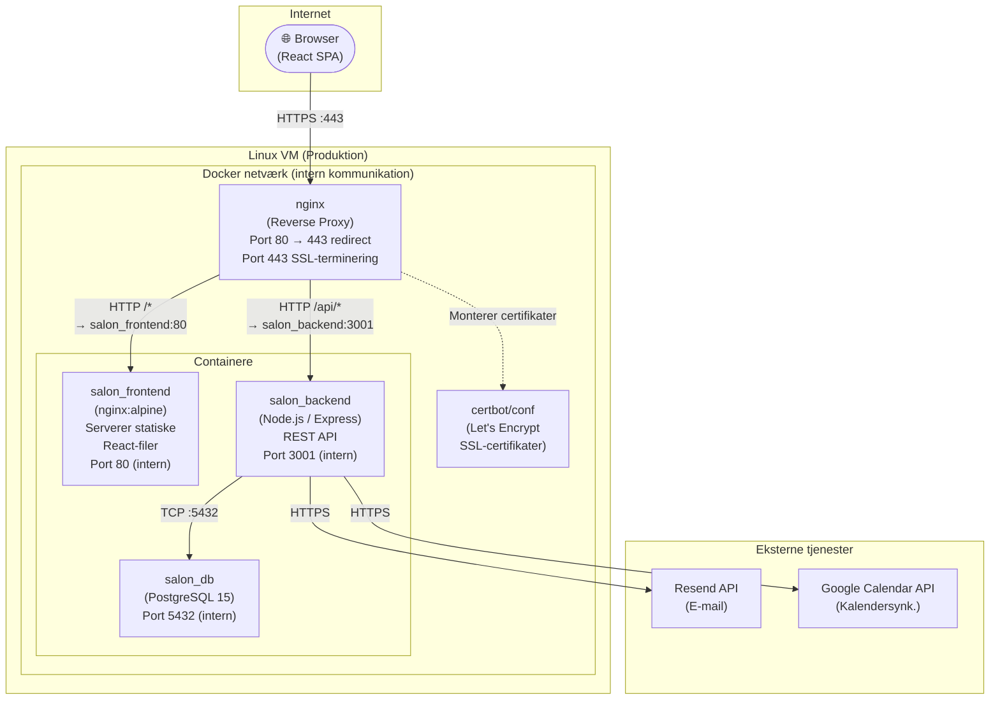
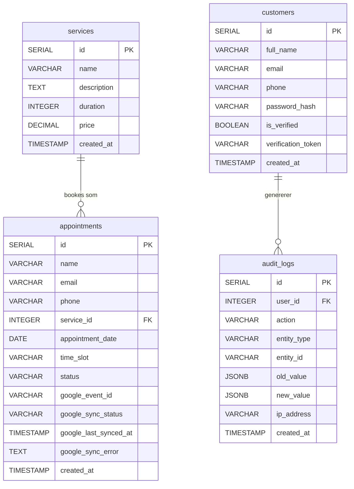

# Nordisk Hår — Bookingsystem
## Afsluttende Eksamensprojekt

**Dato:** 07/maj/2025  
**[Studerendes Navn]:** [Dit navn]  
**[Studerendes E-mail]:** [Din e-mail]  

**Institution:** UCL Erhvervsakademi og Professionshøjskole  
**Uddannelse:** IT Teknolog  
**Antal tegn:** [Udfyldes til sidst]  
**Vejleder:** [Vejleders navn]  

---

## Abstract

Denne rapport dokumenterer design og udvikling af et fuldt funktionelt, webbaseret bookingsystem til frisørsalonen "Nordisk Hår". Systemet løser en konkret udfordring, som mange små servicevirksomheder står over for: manuel og fejlbehæftet håndtering af tidsbestillinger via telefon og SMS. Formålet med projektet har været at levere en sikker, brugervenlig og driftsklar løsning, som kan sættes i produktion og bruges i en virkelig kontekst.

Systemet giver kunderne mulighed for at oprette en konto, bekræfte deres identitet via e-mail og booke ledige tider online. Salonens ejer har adgang til et rollebaseret administrationspanel, hvorfra alle bookinger kan ses og administreres. Nye bookinger synkroniseres automatisk til Google Kalender, og alle vigtige handlinger registreres i en audit log.

Den tekniske løsning er bygget på en tre-lagsarkitektur bestående af en React 18-frontend, en Node.js/Express REST API-backend og en PostgreSQL-database — orchestreret med Docker Compose og deployeret til en Linux-server via en automatiseret GitHub Actions CI/CD-pipeline. Sikkerhed har været en central prioritet i hele udviklingsforløbet, hvilket har ført til implementering af JWT-autentifikation med httpOnly cookies, bcrypt-hashning af adgangskoder, e-mailverifikation, rate limiting, parameteriserede SQL-forespørgsler, Fail2ban og HTTPS via Let's Encrypt.

De primære teorier og metoder, der er anvendt i projektet, omfatter REST-arkitekturprincipperne, OWASP Top 10-retningslinjerne for websikkerhed samt MoSCoW-metoden til prioritering af krav.

Resultatet er et fuldt operationelt system, der er tilgængeligt over HTTPS, med automatiseret deployment, audit logging og et administrationspanel — og som opfylder samtlige funktionelle og ikke-funktionelle krav defineret ved projektstart.

---

## Indholdsfortegnelse

1. Abstract
2. Indholdsfortegnelse
3. Introduktion
4. Problemformulering
5. Kravspecifikation
6. Systemarkitektur
7. Databasedesign
8. Autentifikation og autorisation
9. Backend-udvikling og API
10. Frontend-udvikling
11. Sikkerhed
12. CI/CD og deployment
13. Google Calendar-integration
14. Test
15. Brug af kunstig intelligens
16. Konklusion
17. Litteraturliste

---

## 1. Introduktion

Mange små servicevirksomheder, såsom frisørsaloner, håndterer bookinger manuelt via telefon eller SMS. Dette er tidskrævende, fejlbehæftet og skalerer dårligt. Kunder kan heller ikke se ledige tider uden at kontakte salonen direkte, hvilket skaber friktion i hverdagen.

Dette projekt løser dette problem ved at udvikle et fuldt fungerende online bookingsystem for frisørsalonen "Nordisk Hår". Systemet giver kunder mulighed for at oprette en konto, bekræfte deres e-mail og booke tider online — alt sammen uden at kontakte salonen. Salonens ejer får et administrationspanel, hvorfra alle bookinger kan ses og administreres, og nye bookinger synkroniseres automatisk til Google Kalender.

Projektet er gennemført som et afsluttende eksamensprojekt på IT Teknolog-uddannelsen ved UCL og repræsenterer en fuld produktionsklar løsning, inklusiv sikkerhed, containerisering og automatiseret deployment.

---

## 2. Problemformulering

> **Hvordan kan der udvikles et sikkert, brugervenligt og driftklart online bookingsystem til en frisørsalon, der understøtter kundeoprettelse med e-mailverifikation, rollebaseret adgangskontrol og automatisk synkronisering med Google Kalender — og som kan deployeres i et containeriseret miljø med automatiseret CI/CD?**

Underspørgsmål:
- Hvilke sikkerhedsforanstaltninger er nødvendige for at beskytte en webapplikation i produktion?
- Hvordan designes en REST API, der håndterer autentifikation, autorisering og dataintegritet?
- Hvordan kan Docker og GitHub Actions bruges til at sikre reproducerbare deployments?

---

## 3. Kravspecifikation

### 3.1 Metode og fremgangsmåde

Kravspecifikationen er udarbejdet med MoSCoW-metoden¹, som er en anerkendt prioriteringsmetode inden for kravhåndtering og agil softwareudvikling. Metoden opdeler krav i fire kategorier: *Must have* (skal med), *Should have* (bør med), *Could have* (kan med hvis tid) og *Won't have* (medtages ikke i denne iteration). Fordelen ved MoSCoW er, at den tvinger en eksplicit prioriteringsdiskussion, der sikrer at de mest værdiskabende funktioner færdiggøres først — frem for at projektet forsøger at realisere alt på én gang og risikerer at levere ingenting fuldt ud.

Kravene er identificeret ud fra en analyse af målgruppens behov: en lille frisørsalon der ønsker at digitalisere sin booking, og dens kunder der forventer en nem og selvbetjent oplevelse. Der er bevidst fravalgt krav, der ville øge kompleksiteten markant uden at tilføre tilsvarende kerneværdi i projektets tidsramme.

### 3.2 Begrundelse for prioriterede krav

**Must have — Kundeoprettelse, login og e-mailverifikation**

Et bookingsystem forudsætter at vi ved, hvem der booker. Uden autentifikation ville det ikke være muligt at knytte en booking til en specifik person, og der ville ikke være nogen barriere mod misbrug, f.eks. at én person spammer systemet med falske bookinger. Login er derfor en absolut forudsætning for alt andet funktionalitet.

E-mailverifikation er valgt som *Must have* frem for f.eks. telefonverifikation (SMS) af to grunde: dels er det væsentligt billigere i drift (SMS-APIs som Twilio koster per besked, mens e-mail via Resend er gratis i det forventede volumen), dels er det teknisk enklere at implementere uden afhængighed af mobilnetværk. Verifikationen sikrer desuden at de kontaktoplysninger, salonen har på en kunde, faktisk er gyldige.

**Must have — Visning af ydelser og booking af ledige tider**

Dette er systemets primære forretningsværdi. Uden mulighed for at se og booke tider er der ingen grund til at systemet eksisterer. Tilgængeligheds-API'et (`GET /api/availability/:date`) returnerer allerede booket tidslots, så frontend kan forhindre dobbelttid. Alternativet — at håndtere konflikter manuelt af salonen — er netop det problem der ønskes løst.

**Must have — Persistent database**

Data skal overleve servergenstart. En simpel in-memory løsning som f.eks. en JSON-fil eller et JavaScript-array ville være tilstrækkeligt til et proof-of-concept, men er uacceptabelt i produktion. PostgreSQL er valgt frem for alternativer som MySQL/MariaDB grundet bedre understøttelse af JSONB-kolonner (til audit log), stærk ACID-compliance og bred dokumentation. En NoSQL-løsning som MongoDB er fravalgt, da bookingdata er naturligt relationelt struktureret (kunder, ydelser, tider) og drager stor fordel af fremmednøglerelationer og JOINs.

**Should have — Google Kalender-synkronisering**

Google Kalender-integration er kategoriseret som *Should have* frem for *Must have*, fordi systemet er fuldt funktionelt uden den — salonens ejer kan stadig se alle bookinger i administrationspanelet. Integrationen tilfører dog stor praktisk værdi: frisøren bruger sandsynligvis allerede Google Kalender til sin arbejdsdag, og automatisk synkronisering eliminerer det manuelle arbejde med at overføre bookinger. Integrationen er implementeret med en Google Service Account med minimalt tildelt scope (`calendar.events`), hvilket følger princippet om *least privilege*.

**Should have — Audit log**

En audit log er ikke synlig for slutbrugeren, men er afgørende for driftssikkerhed og ansvarlighed. Loggen registrerer hvem der har gjort hvad, hvornår og fra hvilken IP-adresse. Dette er særligt vigtigt for handlinger som kontooprettelse, login-forsøg og ændringer af bookingstatus. Uden en audit log ville det f.eks. ikke være muligt at efterforske hvis en booking uventet ændres eller slettes. Audit logging er desuden god praksis i henhold til OWASP Top 10 (A09 – Security Logging and Monitoring Failures)⁴.

**Should have — HTTPS i produktion**

HTTPS er en absolut minimumskrav for enhver webapplikation der håndterer persondata og login. Uden kryptering ville adgangskoder og JWT-tokens transmitteres i klartekst over netværket og kunne aflyttes. Certbot og Let's Encrypt er valgt frem for betalte SSL-certifikater, da de tilbyder gratis automatisk fornyelse og er anerkendt industristandard.

**Could have — Medarbejderrolle og kunde-selvbetjening**

En dedikeret medarbejderrolle — der kan se dagens bookinger men ikke har fuld administratoradgang — ville øge systemets brugbarhed i en salon med ansatte. Dette krav er nedprioriteret til *Could have* fordi det kræver en udvidelse af rollemodellen, nye frontend-sider og yderligere API-endpoints, hvilket ville have presset projektets tidsramme. Grundstrukturen med `isAdmin`-flaget i JWT-tokenet er dog designet til at gøre denne udvidelse relativt enkel i en fremtidig iteration.

Kunde-selvbetjening (visning og annullering af egne bookinger) er ligeledes *Could have*. Det ville forbedre brugeroplevelsen markant, men er ikke nødvendigt for at systemets kernefunktion — booking — virker.

**Won't have — Betalingsintegration og mobilapp**

Betalingsintegration via f.eks. Stripe er et komplekst domæne med egne certificeringskrav (PCI DSS) og ville alene udgøre et selvstændigt projekt. Det er ikke en del af kravene fra salonens side og er derfor eksplicit udelukket. En dedikeret mobilapp er fravalgt til fordel for et responsivt webdesign, der fungerer på alle skærmstørrelser — dette giver 90% af fordelene ved en mobilapp uden den tilhørende kompleksitet i udvikling og vedligeholdelse.

### 3.3 Funktionelle krav

### Tabel 1: Funktionelle krav (MoSCoW)

| Prioritet     | Krav                                                                 |
|---------------|----------------------------------------------------------------------|
| Must have     | Kunder kan oprette konto og logge ind                                |
| Must have     | E-mailverifikation ved kontooprettelse                               |
| Must have     | Kunder kan se ydelser og booke ledige tider                          |
| Must have     | Admin kan se og administrere alle bookinger                          |
| Must have     | Data gemmes persistent i en database                                 |
| Should have   | Automatisk synkronisering til Google Kalender                        |
| Should have   | Audit log over alle vigtige handlinger                               |
| Should have   | Systemet er tilgængeligt over HTTPS i produktion                     |
| Could have    | Rollebaseret adgang for medarbejdere (ikke kun admin)                |
| Could have    | Kunde kan se og annullere egne bookinger                             |
| Won't have    | Betalingsintegration (f.eks. Stripe)                                 |
| Won't have    | Mobilapp                                                             |

### 3.4 Ikke-funktionelle krav

De ikke-funktionelle krav definerer systemets kvalitetsegenskaber — ikke hvad systemet gør, men hvordan det gør det. Disse er særligt vigtige i et produktionssystem, hvor sikkerhed, driftsstabilitet og vedligeholdelighed ikke er valgfrie.

### Tabel 2: Ikke-funktionelle krav

| Kategori        | Krav                                                                |
|-----------------|---------------------------------------------------------------------|
| Sikkerhed       | Adgangskoder hashes med bcrypt (cost factor 10)                     |
| Sikkerhed       | JWT-tokens lagres i httpOnly cookies (ikke localStorage)            |
| Sikkerhed       | Alle SQL-forespørgsler er parameteriserede                           |
| Sikkerhed       | Rate limiting på auth-endpoints (5 forsøg/time)                     |
| Ydeevne         | API svarer inden for 500 ms under normal belastning                 |
| Driftsikkerhed  | Systemet kan deployeres reproducerbart med Docker Compose           |
| Vedligeholdelse | Kode er struktureret i tydelige lag (frontend/backend/database)     |

Valget af bcrypt frem for f.eks. MD5 eller SHA-256 til adgangskodelagring er bevidst: bcrypt er designet til at være beregningsmæssigt tungt og indeholder et salt, hvilket gør det modstandsdygtigt over for rainbow table-angreb og brute force. Cost factor 10 er den anbefalede standardværdi og balancerer sikkerhed og serverbelastning. JWT-tokens i httpOnly cookies er valgt frem for localStorage, fordi JavaScript ikke kan tilgå httpOnly cookies — og dermed er tokens beskyttet mod XSS-angreb (Cross-Site Scripting), som er en af de hyppigst forekommende sårbarheder i webapplikationer.

---

## 4. Systemarkitektur

### 4.1 Overordnet arkitektur

Systemet er bygget på en klassisk **tre-lagsarkitektur**², der opdeler applikationen i tre ansvarsmæssigt adskilte lag: præsentationslag (frontend), applikationslag (backend API) og datalag (database). Denne adskillelse sikrer at hvert lag kan udvikles, testes og skaleres uafhængigt af de andre.

Alle tre lag kører som isolerede Docker-containere og orkestreres af Docker Compose. En fjerde container — en nginx reverse proxy — fungerer som systemets eneste indgangspunkt fra omverdenen. Det er et bevidst sikkerhedsvalg: hverken backend eller database eksponerer porte direkte til internettet. Al trafik går igennem nginx, som terminerer SSL og fordeler forespørgsler til de rette containere internt i Docker-netværket.

### Figur 1: Systemarkitekturdiagram



### 4.2 nginx — reverse proxy og SSL-terminering

nginx er det eneste led i systemet der er eksponeret mod internettet (port 80 og 443). Den har to centrale opgaver:

**HTTP → HTTPS-omdirigering:** Al trafik på port 80 omdirigeres automatisk med en `301 Moved Permanently` til HTTPS. Dette sikrer at ingen data nogensinde transmitteres i klartekst.

**Routing af forespørgsler:** På port 443 skelner nginx mellem to typer forespørgsler baseret på URL-sti:
- Forespørgsler til `/api/*` proxies videre til `salon_backend` på port 3001
- Alle øvrige forespørgsler (`/`) proxies til `salon_frontend` på port 80

nginx videresender desuden de originale HTTP-headere (`X-Real-IP`, `X-Forwarded-For`, `X-Forwarded-Proto`) til backend-containeren, så applikationen kan logge den rigtige klient-IP-adresse frem for nginx's interne IP.

SSL-certifikaterne er udstedt af Let's Encrypt via Certbot og monteres som et Docker-volume ind i nginx-containeren. Certbot-udfordringen (domæneverifikation) foregår via mappen `/var/www/certbot`, som ligeledes er monteret ind i nginx. Kun TLS 1.2 og 1.3 er tilladt.

### 4.3 Frontend-containeren

Frontend-applikationen er en React 18 Single Page Application (SPA). Under CI/CD-pipelinen bygges applikationen til statiske filer (`npm run build`), der kopieres ind i en `nginx:alpine`-container. Denne container serverer udelukkende de statiske filer internt i Docker-netværket — den er aldrig tilgængelig direkte fra internettet.

Fordi applikationen er en SPA, håndterer React Router al navigation klient-sidebaseret. nginx-konfigurationen i frontend-containeren er konfigureret til at returnere `index.html` for alle stier, så direkte URL-adgang (f.eks. `/admin`) fungerer korrekt.

### 4.4 Backend-containeren

Backend-containeren kører en Node.js/Express-applikation og eksponerer kun port 3001 internt i Docker-netværket. Den har ansvar for al forretningslogik: autentifikation, bookingvalidering, e-mailafsendelse og Google Kalender-synkronisering.

Ved opstart forsøger backend at oprette forbindelse til databasen med automatisk retry-logik (op til 5 forsøg med 2 sekunders interval). Dette er nødvendigt fordi Docker Compose godt kan starte containere parallelt, og databasen kan have brug for et par sekunder på at initialisere sig, inden den accepterer forbindelser. Backend har desuden et healthcheck-endpoint (`GET /api/health`) som Docker og nginx bruger til at verificere at applikationen er oppe.

### 4.5 Databasecontaineren og datalagring

PostgreSQL-databasen kører i en `postgres:15-alpine`-container og eksponerer kun port 5432 internt. Databasens data gemmes i et navngivet Docker-volume (`postgres_data`), som overlever container-genstarter og opdateringer. Databaseskemaet initialiseres automatisk via `init.sql`, der monteres ind i containeren og eksekveres af PostgreSQL ved første opstart.

### 4.6 Opstartsrækkefølge og afhængigheder

Docker Compose håndterer containerafhængigheder via `depends_on` kombineret med healthchecks, så containerne starter i korrekt rækkefølge:

```
db (postgres klar) → backend (API klar) → frontend (startet) → nginx (klar)
```

Dette forhindrer fejl hvor f.eks. backend forsøger at forespørge databasen, inden PostgreSQL er fuldt initialiseret.

### 4.7 Teknologistack og begrundelse

| Komponent        | Teknologi                | Begrundelse                                                                 |
|------------------|--------------------------|-----------------------------------------------------------------------------|
| Frontend         | React 18                 | Komponentbaseret arkitektur, stor community, velegnet til dynamiske UI'er   |
| Backend          | Node.js + Express        | Asynkron I/O passer godt til en API-server med mange samtidige forespørgsler|
| Database         | PostgreSQL 15            | ACID-kompatibel, understøtter JSONB (audit log), stærk relationel model     |
| Web server       | nginx                    | Høj ydeevne som reverse proxy, simpel konfiguration af routing og SSL       |
| Containerisering | Docker + Docker Compose  | Garanterer ens miljø fra udvikling til produktion, nem skalering            |
| CI/CD            | GitHub Actions           | Tæt integreret med GitHub, gratis, veldokumenteret                          |
| SSL              | Let's Encrypt + Certbot  | Gratis, automatisk fornyelse, industri-standard                             |
| E-mail           | Resend API               | Moderne transaktionel e-mail-API, generøst gratis niveau                    |
| Kalender         | Google Calendar API v3   | Bred adoption, stabil API, god dokumentation                                |

---

## 5. Databasedesign

### 5.1 Valg af databasesystem

Systemet bruger **PostgreSQL 15** som database. PostgreSQL er en **relationsdatabase**, hvilket vil sige at data er organiseret i tabeller med rækker og kolonner — tænk på det som flere regneark der kan snakke sammen. Det der adskiller en relationsdatabase fra f.eks. en simpel fil eller et regneark er, at tabeller kan kobles sammen via **fremmednøgler**. En fremmednøgle er en kolonne i én tabel, der peger på en række i en anden tabel — på den måde kan man hente oplysninger fra begge tabeller på én gang uden at gemme de samme data to steder.

PostgreSQL er valgt frem for alternativer som MySQL af to konkrete grunde. For det første understøtter det **JSONB-kolonner**, som er en måde at gemme fleksibelt struktureret data (i JSON-format) direkte i databasen. Det bruges i audit-loggen, hvor hver handling kan have et forskelligt sæt oplysninger. For det andet er PostgreSQL fuldt **ACID-kompatibelt**. ACID er et sæt garantier der sikrer at databasen altid er i en konsistent tilstand — kort sagt: en handling enten gennemføres helt eller slet ikke. I et bookingsystem er det vigtigt, fordi en halvt gennemført booking — der f.eks. er gemt i én tabel men ikke en anden — ville skabe forvirring for både kunde og salon.

### 5.2 Tabeller og struktur

Databasen består af fire tabeller. De oprettes automatisk første gang systemet starter, via filen `init.sql`, som PostgreSQL kører som en del af sin opstartsrutine.

### Figur 2: ER-diagram



*(Diagrammet kan eksporteres som billede via [mermaid.live](https://mermaid.live) og indsættes i Word)*

Diagrammet viser de fire tabeller og pilene imellem dem. En pil fra én tabel til en anden betyder at der er et direkte link — en fremmednøgle — så man kan slå data op på tværs af begge tabeller i én forespørgsel.

### 5.3 Gennemgang af de fire tabeller

**`services` — Ydelser**

Denne tabel er salonens prisliste i databaseform. Den indeholder de seks ydelser med navn, beskrivelse, varighed i minutter og pris i kroner. Tabellen udfyldes automatisk ved opstart via `init.sql` og ændres ikke af kunder under brug — den fungerer udelukkende som et opslagsværktøj. Det giver mening at have priser og varighed i databasen frem for skrevet direkte i koden, fordi de så nemt kan opdateres ét sted uden at røre ved selve programmet.

```sql
CREATE TABLE IF NOT EXISTS services (
    id          SERIAL PRIMARY KEY,
    name        VARCHAR(255) NOT NULL,
    description TEXT,
    duration    INTEGER NOT NULL,   -- i minutter
    price       DECIMAL(10, 2) NOT NULL,
    created_at  TIMESTAMP DEFAULT CURRENT_TIMESTAMP
);
```

`SERIAL PRIMARY KEY` betyder at databasen automatisk tildeler hvert ydelse et unikt ID-nummer, der tæller opad fra 1. Det ID bruges, når en booking skal kobles til en bestemt ydelse.

**`customers` — Kundernes konti**

Her gemmes alle registrerede kunder. Den vigtigste kolonne er `password_hash` — adgangskoden gemmes **aldrig i klartekst**. Når en kunde opretter konto, omdannes adgangskoden med en algoritme kaldet **bcrypt**, der laver en uigenkendelig streng ud af den. Den streng er det eneste der gemmes. Selv hvis databasen faldt i de forkerte hænder, ville angriberen ikke kunne læse de originale adgangskoder.

`is_verified` og `verification_token` styrer e-mailbekræftelsesflowet. Nye kunder starter med `is_verified = false` og får tilsendt en tilfældig kode. Koden gemmes midlertidigt i `verification_token`. Når kunden indtaster den korrekte kode, sættes `is_verified = true` og koden slettes fra databasen. Kunden kan ikke booke tider så længe `is_verified` er `false`.

`email` har begrænsningen `UNIQUE`, som betyder at databasen selv afviser forsøg på at registrere to konti med samme e-mailadresse — det er altså en regel der håndhæves direkte i databasen og ikke kun i applikationskoden.

```sql
CREATE TABLE IF NOT EXISTS customers (
    id                 SERIAL PRIMARY KEY,
    full_name          VARCHAR(255) NOT NULL,
    email              VARCHAR(255) NOT NULL UNIQUE,
    phone              VARCHAR(50) NOT NULL,
    password_hash      VARCHAR(255) NOT NULL,
    is_verified        BOOLEAN NOT NULL DEFAULT FALSE,
    verification_token VARCHAR(64),
    created_at         TIMESTAMP DEFAULT CURRENT_TIMESTAMP
);
```

**`appointments` — Bookinger**

Dette er den centrale tabel i systemet — det er her selve bookingerne lever. Kolonnen `service_id` er en **fremmednøgle**, der peger på en ydelse i `services`-tabellen. Det betyder at man ikke kan oprette en booking med en ydelse der ikke eksisterer — databasen afviser det automatisk.

Kundens navn, e-mail og telefon gemmes direkte på bookingen frem for kun at referere til `customers`-tabellen. Det er et bevidst valg: hvis en kundekonto slettes på et tidspunkt, skal salonens bookinghistorik stadig give mening. Uden disse kolonner på selve bookingen ville gamle bookinger miste alle oplysninger om hvem der bestilte.

`status` kan kun være `'confirmed'` eller `'cancelled'`. Bookinger slettes aldrig fra databasen — de annulleres. Det sikrer at der altid er en fuld historik over hvad der er sket.

De fire Google-kolonner (`google_event_id`, `google_sync_status`, `google_last_synced_at`, `google_sync_error`) bruges til at holde styr på om bookingen er synkroniseret til Google Kalender. `google_sync_status` viser om synkroniseringen lykkedes, afventer, fejlede eller er deaktiveret — det gør det muligt at se præcist hvad der gik galt, hvis en synkronisering ikke gennemføres.

**`audit_logs` — Hændelseslog**

Audit-loggen er systemets løbende dagbog. Hver gang noget vigtigt sker i systemet — en konto oprettes, nogen logger ind, en booking ændres — skrives en ny række i denne tabel med tidsstempel, bruger-ID og IP-adresse.

Kolonnerne `old_value` og `new_value` er af typen **JSONB**, som er databasens måde at gemme fleksibelt struktureret data på. De gemmer et snapshot af situationen *før* og *efter* en ændring. Hvis en admin f.eks. ændrer en bookings status fra `confirmed` til `cancelled`, gemmes begge værdier, så man altid kan se hvad der skete. JSONB er valgt frem for faste kolonner fordi en login-hændelse og en bookingændring har helt forskellige oplysninger — med JSONB kan begge typer gemmes i samme tabel.

`user_id` er en fremmednøgle til `customers`, men med en særlig regel: `ON DELETE SET NULL`. Det betyder at hvis en kundekonto slettes, forsvinder log-rækkerne ikke med den — bruger-ID'et sættes blot til tomt (`NULL`). Hændelserne er stadig der med tidsstempel og IP-adresse, man ved bare ikke længere hvem brugeren var.

```sql
CREATE TABLE IF NOT EXISTS audit_logs (
    id          SERIAL PRIMARY KEY,
    user_id     INTEGER NULL REFERENCES customers(id) ON DELETE SET NULL,
    action      VARCHAR(100) NOT NULL,
    entity_type VARCHAR(100) NOT NULL,
    entity_id   VARCHAR(255),
    old_value   JSONB,
    new_value   JSONB,
    ip_address  VARCHAR(45),
    created_at  TIMESTAMP DEFAULT CURRENT_TIMESTAMP
);
```

### 5.4 Hvordan tabellerne hænger sammen

De to **fremmednøgler** i databasen skaber forbindelsen mellem tabellerne:

- `appointments.service_id` peger på `services.id`. Det vil sige: en booking har altid en tilknyttet ydelse, og den ydelse skal findes i `services`-tabellen. Man kan altså ikke ved et uheld oprette en booking med en ydelse der ikke eksisterer — databasen stopper det.
- `audit_logs.user_id` peger på `customers.id`, men må gerne være tom. Det er fordi ikke alle log-hændelser nødvendigvis har en bruger tilknyttet, og fordi sletning af en kundekonto ikke må fjerne loghistorikken.

Begge relationer er af typen **mange-til-en**: mange bookinger kan referere til den samme ydelse, og én kunde kan have mange rækker i audit-loggen.

### 5.5 Indeksering og søgehastighed

Når databasen skal finde bestemte rækker i en stor tabel, skal den som udgangspunkt kigge alle rækker igennem én for én — ligesom at lede efter et navn i en telefonbog uden alfabetisk orden. Et **indeks** løser det: databasen bygger en sorteret oversigt over en bestemt kolonne, så den hurtigt kan hoppe direkte til de relevante rækker.

`audit_logs` er den eneste tabel der vokser løbende og vil over tid have mange tusinde rækker, så det er her indekser giver mest mening. Der er oprettet tre:

```sql
-- Gør det hurtigt at hente de seneste hændelser sorteret efter tidspunkt
CREATE INDEX IF NOT EXISTS idx_audit_logs_created_at
    ON audit_logs(created_at);

-- Gør det hurtigt at finde alle hændelser knyttet til f.eks. booking #42
CREATE INDEX IF NOT EXISTS idx_audit_logs_entity
    ON audit_logs(entity_type, entity_id);

-- Gør det hurtigt at finde alle hændelser knyttet til en bestemt bruger
CREATE INDEX IF NOT EXISTS idx_audit_logs_user_id
    ON audit_logs(user_id);
```

De øvrige tabeller har kun det indeks der automatisk oprettes på primærnøglen (`id`), da de er relativt små og ikke forespørges i samme omfang.

---

## 6. Autentifikation og autorisation

Systemet understøtter to brugerroller: **kunde** og **administrator**. Administratorrollen tildeles baseret på en specifik e-mailadresse konfigureret i miljøvariablen `ADMIN_EMAIL`. Fremadrettet er der planlagt en egentlig medarbejderrolle.

### Autentifikationsflow

1. Kunden opretter konto via `POST /api/customers/register`
2. Adgangskoden hashes med `bcrypt` (cost factor 10) og gemmes i databasen
3. En tilfældig 8-cifret hex-kode genereres og sendes til kundens e-mail via Resend API
4. Kunden bekræfter koden via `POST /api/auth/verify`
5. Ved succesfuld bekræftelse udstedes et JWT-token (7 dages gyldighed) og sættes som `httpOnly` cookie

```
[Register] → [Verify Email] → [Login] → [JWT Cookie] → [Protected routes]
```

### JWT og httpOnly cookies

JWT-tokenet lagres i en `httpOnly` cookie (ikke i `localStorage` eller `sessionStorage`). Dette er en bevidst sikkerhedsbeslutning, da `httpOnly` cookies ikke kan tilgås af JavaScript i browseren, og dermed er beskyttet mod XSS-angreb (Cross-Site Scripting)³.

Token-payload indeholder: bruger-ID, navn, e-mail, `isAdmin`-flag og `isVerified`-flag.

### Autorisationsmiddleware

Tre middleware-funktioner beskytter API-endpoints:

- `requireAuth` — validerer JWT-tokenet
- `requireAdmin` — kræver at `isAdmin` er `true` i token-payload
- `requireVerifiedCustomer` — kontrollerer at kundens e-mail er bekræftet i databasen

```
POST /api/appointments  →  requireAuth  →  requireVerifiedCustomer  →  handler
GET  /api/admin/*       →  requireAuth  →  requireAdmin             →  handler
```

---

## 7. Backend-udvikling og API

Backend er implementeret med Node.js og Express og eksponerer en RESTful API. Alle endpoints følger HTTP-standarderne for metoder og statuskoder.

### Tabel 4: API-oversigt

| Metode | Endpoint                         | Auth          | Beskrivelse                          |
|--------|----------------------------------|---------------|--------------------------------------|
| GET    | `/api/health`                    | Ingen         | Health check                         |
| GET    | `/api/services`                  | Ingen         | Hent alle ydelser                    |
| GET    | `/api/availability/:date`        | Ingen         | Hent booket tidslots for en dato     |
| POST   | `/api/customers/register`        | Ingen         | Opret kundekonto                     |
| POST   | `/api/auth/verify`               | Ingen         | Bekræft e-mail med kode              |
| POST   | `/api/login`                     | Ingen         | Log ind                              |
| POST   | `/api/logout`                    | Ingen         | Log ud (ryd cookie)                  |
| GET    | `/api/me`                        | requireAuth   | Hent aktuel bruger                   |
| POST   | `/api/appointments`              | Auth + Verified| Opret booking                       |
| GET    | `/api/admin/appointments`        | Admin         | Hent alle bookinger                  |
| PATCH  | `/api/admin/appointments/:id`    | Admin         | Opdater bookingstatus                |
| GET    | `/api/admin/system-status`       | Admin         | Docker og backup VM-status           |
| GET    | `/api/admin/backup/logs`         | Admin         | Vis backup-logs                      |

### SQL Injection-beskyttelse

Alle databaseforespørgsler benytter parameteriserede statements ($1, $2, ...) via `pg`-biblioteket. Ingen brugerinput interpoleres direkte i SQL-strenge.

```javascript
// Eksempel på parameteriseret query
const result = await pool.query(
  'SELECT id FROM customers WHERE email = $1',
  [email]
);
```

### Structured logging

Backend benytter Winston til struktureret JSON-logging med separate filer til `combined.log` og `error.log`. Logs roteres dagligt og er tilgængelige for admin-brugeren via API'et.

---

## 8. Frontend-udvikling

Frontend er en Single Page Application (SPA) bygget i React 18, der kommunikerer med backend via HTTP-kald. Den statiske applikation bygges under CI/CD og serveres af en nginx-container i produktion.

### Komponentstruktur

```
App.js
├── Header.js          — Navigation og login/logout-knapper
├── ServiceCard.js     — Visning af ydelse (navn, pris, varighed)
├── BookingForm.js     — Kalender, tidsvælger og bookingformular
├── AdminDashboard.js  — Oversigt over bookinger (admin-only)
└── VerifyEmailModal.js — Pop-up til e-mailbekræftelse
```

Frontend beskytter admin-ruter klient-sidebaseret via `isAdmin`-flaget returneret fra `/api/me`. Da sessionen gendannes fra en `httpOnly` cookie, vedligeholdes login-tilstand automatisk på tværs af browser-genindlæsninger.

### Figur 3: Skærmbillede af bookingformular — [Indsæt screenshot her]

### Figur 4: Skærmbillede af admin-dashboard — [Indsæt screenshot her]

### Responsivt design

Applikationen er fuldt responsiv og fungerer på mobile enheder, tablets og desktop. Farvepalet er baseret på jordnære grønne toner (Sage Green `#6b9f78`, Mint Green `#a8d5ba`), der understøtter salonens æstetik.

---

## 9. Sikkerhed

Sikkerhed er behandlet systematisk med udgangspunkt i OWASP Top 10⁴, som identificerer de mest kritiske sikkerhedsrisici i webapplikationer.

### Tabel 5: OWASP Top 10 — projektets mitigationer

| OWASP Risiko                       | Implementeret mitigation                                              |
|------------------------------------|-----------------------------------------------------------------------|
| A01 – Broken Access Control        | `requireAuth` / `requireAdmin` middleware på alle beskyttede endpoints|
| A02 – Cryptographic Failures       | bcrypt (cost 10) til adgangskoder, HTTPS via Let's Encrypt            |
| A03 – Injection                    | Alle SQL-queries parameteriserede (ingen string interpolation)        |
| A05 – Security Misconfiguration    | CORS konfigureret til kun at tillade kendte origins                   |
| A07 – Identification & Auth        | JWT httpOnly cookies, e-mailverifikation, rate limiting               |
| A09 – Security Logging             | Audit log for alle vigtige handlinger, Winston til server-logs        |

### Rate limiting

To separate rate limiters beskytter API'et:

- **General limiter:** 100 forespørgsler per 15 minutter (alle `/api`-endpoints)
- **Auth limiter:** 5 forsøg per time (login og e-mailverifikation)

### Fail2ban

Serveren kører Fail2ban, der automatisk blokerer IP-adresser, der genererer mange 4xx-fejl mod nginx. Dette beskytter mod automatiserede scannere og brute force-angreb.

### Audit log

`AuditService`-klassen logger alle vigtige handlinger til tabellen `audit_logs`:

| Action                        | Beskrivelse                                    |
|-------------------------------|------------------------------------------------|
| `CUSTOMER_REGISTERED`         | Ny konto oprettet                              |
| `CUSTOMER_VERIFIED`           | E-mail bekræftet                               |
| `LOGIN_SUCCESS`               | Succesfuldt login                              |
| `APPOINTMENT_CREATED`         | Ny booking oprettet                            |
| `APPOINTMENT_STATUS_UPDATED`  | Admin har ændret bookingstatus                 |
| `GOOGLE_EVENT_CREATE_SUCCESS` | Google Kalender-event oprettet                 |
| `GOOGLE_EVENT_DELETE_SUCCESS` | Google Kalender-event slettet                  |

Audit loggen indeholder: tidsstempel, bruger-ID, IP-adresse, den berørte entitet samt old/new values i JSONB-format.

---

## 10. CI/CD og deployment

Projektet benytter en fuldt automatiseret CI/CD-pipeline via GitHub Actions, der trigges ved push til `main`-branchen.

### Figur 5: CI/CD flow — [Indsæt diagram her]

### Pipeline-trin

1. **Checkout** kodebasen
2. **Byg og push** Docker-images til GitHub Container Registry (ghcr.io)
3. **Opret `.env`** fra GitHub Secret `ENV_FILE`
4. **Kopiér filer** til produktions-VM via SCP (docker-compose.prod.yml, nginx.conf, website/)
5. **Valider miljøvariabler** på VM (script fejler hvis påkrævede variabler mangler)
6. **Pull og start** containere med `docker compose up -d --remove-orphans`

### Tabel 6: GitHub Secrets

| Secret              | Formål                                        |
|---------------------|-----------------------------------------------|
| `ENV_FILE`          | Hele `.env`-filen til produktion               |
| `VM_HOST`           | IP/hostname på produktionsserveren             |
| `VM_USER`           | SSH-bruger                                    |
| `VM_SSH_KEY`        | SSH-privat nøgle                              |
| `VM_PROJECT_PATH`   | Sti på VM (f.eks. `/root/apps`)               |

### Produktionsmiljø

- **Web server:** nginx (reverse proxy + statisk filservering)
- **SSL:** Let's Encrypt via Certbot, automatisk fornyelse
- **Backup:** Nightly backup-script med log tilgængeligt via admin-panelet
- **Google Calendar:** Integreret via Service Account med begrænset scope (`calendar.events`)

---

## 11. Google Calendar-integration

Når en kunde booke en tid, oprettes automatisk et event i salonens Google Kalender via Google Calendar API v3. Integrationen håndteres af `GoogleCalendarService`-klassen og kan aktiveres/deaktiveres via miljøvariablen `GOOGLE_CALENDAR_ENABLED`.

**Autentifikation** sker via en Google Service Account med JWT-autentifikation, der kun har adgang til `calendar.events`-scopet — ikke hele kalenderen.

Hvert event indeholder:
- Sammendrag: `[Ydelse] - [Kundenavn]`
- Beskrivelse: Kundenavn, e-mail, telefon og booking-ID
- Start- og sluttidspunkt beregnet ud fra ydelsens varighed
- `extendedProperties` med booking-ID til referencebrug

Sync-status spores i `appointments`-tabellen (`google_sync_status`: `pending`, `synced`, `failed`, `cancelled`, `disabled`). Fejl logges separat og vises i audit-loggen.

---

## 12. Test

### Manuel test

Systemet er testet manuelt gennem hele udviklingsforløbet. Følgende test-cases er gennemført:

### Tabel 7: Test-cases

| Test case                              | Forventet resultat                                  | Resultat  |
|----------------------------------------|-----------------------------------------------------|-----------|
| Opret konto med ugyldig e-mail         | 400 Bad Request med fejlbesked                      | Bestået   |
| Opret konto med eksisterende e-mail    | 409 Conflict                                        | Bestået   |
| Login med forkert adgangskode          | 401 Unauthorized                                    | Bestået   |
| Book tid uden at være logget ind       | 401 Unauthorized                                    | Bestået   |
| Book tid med ubekræftet e-mail         | 403 Forbidden med `NOT_VERIFIED`-kode               | Bestået   |
| Book samme tid to gange                | 409 Conflict                                        | Bestået   |
| Admin tilgår `/api/admin/*`            | 200 OK med data                                     | Bestået   |
| Ikke-admin tilgår `/api/admin/*`       | 403 Forbidden                                       | Bestået   |
| Rate limit på login (6. forsøg)        | 429 Too Many Requests                               | Bestået   |
| Google Kalender-sync ved ny booking    | Event oprettet i kalender, status = 'synced'        | Bestået   |

### Begrænsninger

Der er ikke skrevet automatiserede unit-tests eller integrationstests. Dette er en known limitation, der anbefales adresseret i en fremtidig iteration.

---

## 13. Brug af kunstig intelligens

I overensstemmelse med UCLs retningslinjer for brug af AI-teknologier⁵ redegøres her for brugen af AI-værktøjer i projektet.

**Anvendt AI-værktøj:** Cursor IDE med Claude Sonnet (Anthropic)

**Hvad AI er brugt til:**
- Generering af boilerplate-kode (Docker Compose-konfiguration, nginx-konfiguration)
- Debugging af fejl og forklaring af fejlbeskeder
- Forslag til struktur på middleware-lag og service-klasser
- Sparring om sikkerhedsimplementeringer (f.eks. valg af httpOnly cookies over localStorage)

**Hvad AI IKKE er brugt til:**
- Alle arkitekturelle beslutninger er truffet selvstændigt
- Forståelsen af de anvendte teknologier og biblioteker er tilegnet via dokumentation og egne eksperimenter
- Rapporten er skrevet selvstændigt

AI-assistancen har øget produktiviteten, men alle beslutninger om teknologivalg, sikkerhedsdesign og systemarkitektur er truffet og begrundet af projektstuderende.

---

## 14. Konklusion

Projektet har resulteret i et fuldt funktionelt og produktionsklar bookingsystem til frisørsalonen "Nordisk Hår". Systemet lever op til de definerede krav:

- Kunder kan oprette og verificere konti og booke tider online
- Admin-brugeren har fuld kontrol via et dedikeret dashboard
- Nye bookinger synkroniseres automatisk til Google Kalender
- Systemet er sikret mod de mest kritiske webtrusler (OWASP Top 10)
- Deployment er fuldt automatiseret via GitHub Actions og Docker

**Uopfyldte krav (Could have):**
Rollebaseret adgang for medarbejdere (udover administrator) er ikke implementeret i den afleverede version. Kunder kan endvidere ikke annullere egne bookinger via frontend-grænsefladen. Disse punkter er identificeret til en fremtidig version.

**Teknisk læring:**
Projektet har givet dybdegående erfaring med full-stack webudvikling, containerisering med Docker, CI/CD med GitHub Actions, og implementering af sikkerhed i webapplikationer. Særligt arbejdet med JWT-autentifikation, bcrypt og OWASP-mitigationer har givet konkret erfaring med produktionsklar sikkerhed.

**Fremtidigt arbejde:**
- Medarbejderrolle med begrænset admin-adgang
- Kunde-selvbetjening: vis og annuller egne bookinger
- Automatiserede integrationstest (f.eks. Jest + Supertest)
- Push-notifikationer til kunder ved aflyste tider

---

## Litteraturliste

¹ Clegg, D., & Barker, R. (1994). *Case Method Fast-Track: A RAD Approach*. Addison-Wesley. (MoSCoW-metoden)

² Fowler, M. (2002). *Patterns of Enterprise Application Architecture*. Addison-Wesley. (Tre-lagsarkitektur)

³ OWASP Foundation. (2021). *OWASP Top 10: A02 – Cryptographic Failures*. https://owasp.org/Top10/A02_2021-Cryptographic_Failures/

⁴ OWASP Foundation. (2021). *OWASP Top 10*. https://owasp.org/Top10/

⁵ UCL Erhvervsakademi og Professionshøjskole. (2024). *Retningslinjer for brug af AI-teknologier*. [Indsæt intern reference/link]

⁶ Docker Inc. (2024). *Docker Compose documentation*. https://docs.docker.com/compose/

⁷ GitHub Inc. (2024). *GitHub Actions documentation*. https://docs.github.com/en/actions

⁸ Google LLC. (2024). *Google Calendar API v3 documentation*. https://developers.google.com/calendar/api/v3/reference

⁹ Auth0 / Okta. (2024). *JWT Introduction*. https://jwt.io/introduction

¹⁰ npm: bcryptjs. (2024). https://www.npmjs.com/package/bcryptjs

---

*Antal tegn (inkl. mellemrum): [Udfyldes til sidst med Word's tegnoptælling — Gennemse → Ordtælling → Tegn inkl. mellemrum]*
